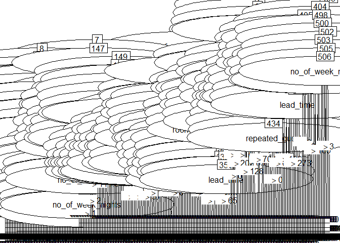
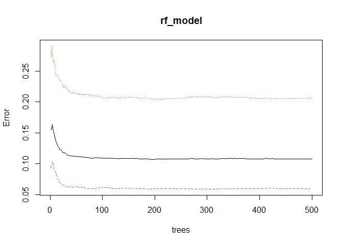
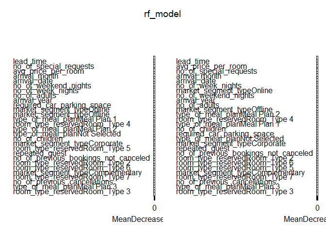

Final Project Draft of Code
================
Third Time’s the Charm
2025-10-23

## Step 0: Why?

**Dataset Chosen:**  
Hotel Reservations (~35,000 rows)  
Predicts hotel booking cancellations and potential no-shows. The
business use case focuses on **optimizing overbooking decisions** to
maximize hotel occupancy and revenue.

### Context (from Kaggle)

> “The online hotel reservation channels have dramatically changed
> booking possibilities and customers’ behavior. A significant number of
> hotel reservations are called-off due to cancellations or no-shows.
> The typical reasons for cancellations include change of plans,
> scheduling conflicts, etc. This is often made easier by the option to
> do so free of charge or preferably at a low cost which is beneficial
> to hotel guests but it is a less desirable and possibly
> revenue-diminishing factor for hotels to deal with.”

### Business Use Case

We are building a model to predict which hotel reservations are most
likely to cancel.  
Although cancellations often result from a change of plans or scheduling
conflicts, they impose a direct financial cost on the hotel.  
To mitigate these losses and **maintain 100% occupancy**, the hotel can
strategically **overbook** based on model predictions of cancellation
likelihood.

**Main Question:**  
Can we predict which hotel reservations are most likely to be canceled,
and use these predictions to make more profitable overbooking decisions?

**Why it’s answerable with this dataset:**  
- The dataset includes **booking-level data** for over 35 000
reservations with both categorical and numerical features (lead time,
room type, guest history, etc.).  
- The dependent variable `booking_status` is binary (Canceled / Not
Canceled), making it well-suited for **classification via logistic
regression**.  
- With exploratory cleaning and modeling, we can estimate how much
predictive signal exists and whether cancellation behavior is
predictable enough to support overbooking decisions.

### Financial Assumptions

- **Revenue per booked room:** \$250 per night on average price in a
  city (source:
  <https://www.coohom.com/article/how-much-do-hotel-rooms-cost>)
- **Cancellations:** Guests can cancel free of charge at any time; each
  cancellation results in a \$250 revenue loss (from the cost of the
  room)  
- **Overbooking cost:** If the hotel overbooks and cannot accommodate a
  guest (because no cancellations occur), it incurs \$500 per night
  because the cost of walking a guest is ~2x the room cost in
  re-accommodation, transportation, goodwill, and/or compensation costs.
  (souce:
  <https://ecornell-impact.cornell.edu/the-cheapest-and-best-approach-to-overbooking/>)
- **Variable costs per room:** Considered sunk and excluded from
  analysis (the cost of turning a room is identical regardless of
  occupancy).  
- **No difference** between cancellation and no-show costs.

### Cost–Benefit Matrix

| Case | Model Prediction | Actual Outcome | Financial Impact |
|----|----|----|----|
| **True Positive (TP)** | “Will Cancel” | Guest cancels | **+ \$250** (revenue from replacement guest) |
| **True Negative (TN)** | “Will Not Cancel” | Guest does not cancel | **\$0** (no change in revenue) |
| **False Negative (FN)** | “Will Not Cancel” | Guest cancels | **– \$250** (lost booking revenue) |
| **False Positive (FP)** | “Will Cancel” | Guest shows up | **– \$500** (overbooking penalty) |

### Objective

Develop a predictive model that helps hotels **balance the trade-off**
between overbooking risk and lost revenue due to cancellations, thereby
maximizing **expected net revenue** and improving operational
decision-making.

### Step 0.5: Load Packages

``` r
library(caret)
```

    ## Loading required package: ggplot2

    ## Loading required package: lattice

``` r
library(neuralnet)
library(class)
library(C50)
library(ggplot2)
library(randomForest)
```

    ## Warning: package 'randomForest' was built under R version 4.5.2

    ## randomForest 4.7-1.2

    ## Type rfNews() to see new features/changes/bug fixes.

    ## 
    ## Attaching package: 'randomForest'

    ## The following object is masked from 'package:ggplot2':
    ## 
    ##     margin

``` r
library(kernlab)
```

    ## 
    ## Attaching package: 'kernlab'

    ## The following object is masked from 'package:ggplot2':
    ## 
    ##     alpha

## Step 1: Load Data

``` r
hotel <- read.csv("Hotel Reservations.csv", stringsAsFactors = TRUE)
```

## Step 2: Clean Data

``` r
str(hotel)
```

    ## 'data.frame':    36275 obs. of  19 variables:
    ##  $ Booking_ID                          : Factor w/ 36275 levels "INN00001","INN00002",..: 1 2 3 4 5 6 7 8 9 10 ...
    ##  $ no_of_adults                        : int  2 2 1 2 2 2 2 2 3 2 ...
    ##  $ no_of_children                      : int  0 0 0 0 0 0 0 0 0 0 ...
    ##  $ no_of_weekend_nights                : int  1 2 2 0 1 0 1 1 0 0 ...
    ##  $ no_of_week_nights                   : int  2 3 1 2 1 2 3 3 4 5 ...
    ##  $ type_of_meal_plan                   : Factor w/ 4 levels "Meal Plan 1",..: 1 4 1 1 4 2 1 1 1 1 ...
    ##  $ required_car_parking_space          : int  0 0 0 0 0 0 0 0 0 0 ...
    ##  $ room_type_reserved                  : Factor w/ 7 levels "Room_Type 1",..: 1 1 1 1 1 1 1 4 1 4 ...
    ##  $ lead_time                           : int  224 5 1 211 48 346 34 83 121 44 ...
    ##  $ arrival_year                        : int  2017 2018 2018 2018 2018 2018 2017 2018 2018 2018 ...
    ##  $ arrival_month                       : int  10 11 2 5 4 9 10 12 7 10 ...
    ##  $ arrival_date                        : int  2 6 28 20 11 13 15 26 6 18 ...
    ##  $ market_segment_type                 : Factor w/ 5 levels "Aviation","Complementary",..: 4 5 5 5 5 5 5 5 4 5 ...
    ##  $ repeated_guest                      : int  0 0 0 0 0 0 0 0 0 0 ...
    ##  $ no_of_previous_cancellations        : int  0 0 0 0 0 0 0 0 0 0 ...
    ##  $ no_of_previous_bookings_not_canceled: int  0 0 0 0 0 0 0 0 0 0 ...
    ##  $ avg_price_per_room                  : num  65 106.7 60 100 94.5 ...
    ##  $ no_of_special_requests              : int  0 1 0 0 0 1 1 1 1 3 ...
    ##  $ booking_status                      : Factor w/ 2 levels "Canceled","Not_Canceled": 2 2 1 1 1 1 2 2 2 2 ...

``` r
summary(hotel)
```

    ##     Booking_ID     no_of_adults   no_of_children    no_of_weekend_nights
    ##  INN00001:    1   Min.   :0.000   Min.   : 0.0000   Min.   :0.0000      
    ##  INN00002:    1   1st Qu.:2.000   1st Qu.: 0.0000   1st Qu.:0.0000      
    ##  INN00003:    1   Median :2.000   Median : 0.0000   Median :1.0000      
    ##  INN00004:    1   Mean   :1.845   Mean   : 0.1053   Mean   :0.8107      
    ##  INN00005:    1   3rd Qu.:2.000   3rd Qu.: 0.0000   3rd Qu.:2.0000      
    ##  INN00006:    1   Max.   :4.000   Max.   :10.0000   Max.   :7.0000      
    ##  (Other) :36269                                                         
    ##  no_of_week_nights    type_of_meal_plan required_car_parking_space
    ##  Min.   : 0.000    Meal Plan 1 :27835   Min.   :0.00000           
    ##  1st Qu.: 1.000    Meal Plan 2 : 3305   1st Qu.:0.00000           
    ##  Median : 2.000    Meal Plan 3 :    5   Median :0.00000           
    ##  Mean   : 2.204    Not Selected: 5130   Mean   :0.03099           
    ##  3rd Qu.: 3.000                         3rd Qu.:0.00000           
    ##  Max.   :17.000                         Max.   :1.00000           
    ##                                                                   
    ##    room_type_reserved   lead_time       arrival_year  arrival_month   
    ##  Room_Type 1:28130    Min.   :  0.00   Min.   :2017   Min.   : 1.000  
    ##  Room_Type 2:  692    1st Qu.: 17.00   1st Qu.:2018   1st Qu.: 5.000  
    ##  Room_Type 3:    7    Median : 57.00   Median :2018   Median : 8.000  
    ##  Room_Type 4: 6057    Mean   : 85.23   Mean   :2018   Mean   : 7.424  
    ##  Room_Type 5:  265    3rd Qu.:126.00   3rd Qu.:2018   3rd Qu.:10.000  
    ##  Room_Type 6:  966    Max.   :443.00   Max.   :2018   Max.   :12.000  
    ##  Room_Type 7:  158                                                    
    ##   arrival_date     market_segment_type repeated_guest   
    ##  Min.   : 1.0   Aviation     :  125    Min.   :0.00000  
    ##  1st Qu.: 8.0   Complementary:  391    1st Qu.:0.00000  
    ##  Median :16.0   Corporate    : 2017    Median :0.00000  
    ##  Mean   :15.6   Offline      :10528    Mean   :0.02564  
    ##  3rd Qu.:23.0   Online       :23214    3rd Qu.:0.00000  
    ##  Max.   :31.0                          Max.   :1.00000  
    ##                                                         
    ##  no_of_previous_cancellations no_of_previous_bookings_not_canceled
    ##  Min.   : 0.00000             Min.   : 0.0000                     
    ##  1st Qu.: 0.00000             1st Qu.: 0.0000                     
    ##  Median : 0.00000             Median : 0.0000                     
    ##  Mean   : 0.02335             Mean   : 0.1534                     
    ##  3rd Qu.: 0.00000             3rd Qu.: 0.0000                     
    ##  Max.   :13.00000             Max.   :58.0000                     
    ##                                                                   
    ##  avg_price_per_room no_of_special_requests      booking_status 
    ##  Min.   :  0.00     Min.   :0.0000         Canceled    :11885  
    ##  1st Qu.: 80.30     1st Qu.:0.0000         Not_Canceled:24390  
    ##  Median : 99.45     Median :0.0000                             
    ##  Mean   :103.42     Mean   :0.6197                             
    ##  3rd Qu.:120.00     3rd Qu.:1.0000                             
    ##  Max.   :540.00     Max.   :5.0000                             
    ## 

Let’s remove booking id. Let’s also convert our dependent variable
(booking status) into 0s and 1s.

``` r
hotel$Booking_ID = NULL
hotel$booking_status <- ifelse(hotel$booking_status == "Canceled", 1, 0)
str(hotel)
```

    ## 'data.frame':    36275 obs. of  18 variables:
    ##  $ no_of_adults                        : int  2 2 1 2 2 2 2 2 3 2 ...
    ##  $ no_of_children                      : int  0 0 0 0 0 0 0 0 0 0 ...
    ##  $ no_of_weekend_nights                : int  1 2 2 0 1 0 1 1 0 0 ...
    ##  $ no_of_week_nights                   : int  2 3 1 2 1 2 3 3 4 5 ...
    ##  $ type_of_meal_plan                   : Factor w/ 4 levels "Meal Plan 1",..: 1 4 1 1 4 2 1 1 1 1 ...
    ##  $ required_car_parking_space          : int  0 0 0 0 0 0 0 0 0 0 ...
    ##  $ room_type_reserved                  : Factor w/ 7 levels "Room_Type 1",..: 1 1 1 1 1 1 1 4 1 4 ...
    ##  $ lead_time                           : int  224 5 1 211 48 346 34 83 121 44 ...
    ##  $ arrival_year                        : int  2017 2018 2018 2018 2018 2018 2017 2018 2018 2018 ...
    ##  $ arrival_month                       : int  10 11 2 5 4 9 10 12 7 10 ...
    ##  $ arrival_date                        : int  2 6 28 20 11 13 15 26 6 18 ...
    ##  $ market_segment_type                 : Factor w/ 5 levels "Aviation","Complementary",..: 4 5 5 5 5 5 5 5 4 5 ...
    ##  $ repeated_guest                      : int  0 0 0 0 0 0 0 0 0 0 ...
    ##  $ no_of_previous_cancellations        : int  0 0 0 0 0 0 0 0 0 0 ...
    ##  $ no_of_previous_bookings_not_canceled: int  0 0 0 0 0 0 0 0 0 0 ...
    ##  $ avg_price_per_room                  : num  65 106.7 60 100 94.5 ...
    ##  $ no_of_special_requests              : int  0 1 0 0 0 1 1 1 1 3 ...
    ##  $ booking_status                      : num  0 0 1 1 1 1 0 0 0 0 ...

``` r
summary(hotel)
```

    ##   no_of_adults   no_of_children    no_of_weekend_nights no_of_week_nights
    ##  Min.   :0.000   Min.   : 0.0000   Min.   :0.0000       Min.   : 0.000   
    ##  1st Qu.:2.000   1st Qu.: 0.0000   1st Qu.:0.0000       1st Qu.: 1.000   
    ##  Median :2.000   Median : 0.0000   Median :1.0000       Median : 2.000   
    ##  Mean   :1.845   Mean   : 0.1053   Mean   :0.8107       Mean   : 2.204   
    ##  3rd Qu.:2.000   3rd Qu.: 0.0000   3rd Qu.:2.0000       3rd Qu.: 3.000   
    ##  Max.   :4.000   Max.   :10.0000   Max.   :7.0000       Max.   :17.000   
    ##                                                                          
    ##     type_of_meal_plan required_car_parking_space   room_type_reserved
    ##  Meal Plan 1 :27835   Min.   :0.00000            Room_Type 1:28130   
    ##  Meal Plan 2 : 3305   1st Qu.:0.00000            Room_Type 2:  692   
    ##  Meal Plan 3 :    5   Median :0.00000            Room_Type 3:    7   
    ##  Not Selected: 5130   Mean   :0.03099            Room_Type 4: 6057   
    ##                       3rd Qu.:0.00000            Room_Type 5:  265   
    ##                       Max.   :1.00000            Room_Type 6:  966   
    ##                                                  Room_Type 7:  158   
    ##    lead_time       arrival_year  arrival_month     arrival_date 
    ##  Min.   :  0.00   Min.   :2017   Min.   : 1.000   Min.   : 1.0  
    ##  1st Qu.: 17.00   1st Qu.:2018   1st Qu.: 5.000   1st Qu.: 8.0  
    ##  Median : 57.00   Median :2018   Median : 8.000   Median :16.0  
    ##  Mean   : 85.23   Mean   :2018   Mean   : 7.424   Mean   :15.6  
    ##  3rd Qu.:126.00   3rd Qu.:2018   3rd Qu.:10.000   3rd Qu.:23.0  
    ##  Max.   :443.00   Max.   :2018   Max.   :12.000   Max.   :31.0  
    ##                                                                 
    ##     market_segment_type repeated_guest    no_of_previous_cancellations
    ##  Aviation     :  125    Min.   :0.00000   Min.   : 0.00000            
    ##  Complementary:  391    1st Qu.:0.00000   1st Qu.: 0.00000            
    ##  Corporate    : 2017    Median :0.00000   Median : 0.00000            
    ##  Offline      :10528    Mean   :0.02564   Mean   : 0.02335            
    ##  Online       :23214    3rd Qu.:0.00000   3rd Qu.: 0.00000            
    ##                         Max.   :1.00000   Max.   :13.00000            
    ##                                                                       
    ##  no_of_previous_bookings_not_canceled avg_price_per_room no_of_special_requests
    ##  Min.   : 0.0000                      Min.   :  0.00     Min.   :0.0000        
    ##  1st Qu.: 0.0000                      1st Qu.: 80.30     1st Qu.:0.0000        
    ##  Median : 0.0000                      Median : 99.45     Median :0.0000        
    ##  Mean   : 0.1534                      Mean   :103.42     Mean   :0.6197        
    ##  3rd Qu.: 0.0000                      3rd Qu.:120.00     3rd Qu.:1.0000        
    ##  Max.   :58.0000                      Max.   :540.00     Max.   :5.0000        
    ##                                                                                
    ##  booking_status  
    ##  Min.   :0.0000  
    ##  1st Qu.:0.0000  
    ##  Median :0.0000  
    ##  Mean   :0.3276  
    ##  3rd Qu.:1.0000  
    ##  Max.   :1.0000  
    ## 

## Step 3: Split Data

We have 36000 data entries. In order to build a second level model, we
are going to keep 30% for evaluation. Let’s dummify and split the data.

``` r
hotel_dummies <- as.data.frame(model.matrix(~ . - booking_status - 1, data = hotel))
hotel_dummies$booking_status <- hotel$booking_status

trainprop <- 0.7
set.seed(12345)
trainrows <- sample(1:nrow(hotel_dummies), trainprop * nrow(hotel_dummies))

hotel_train <- hotel_dummies[trainrows, ]
hotel_test  <- hotel_dummies[-trainrows, ]
str(hotel_train)
```

    ## 'data.frame':    25392 obs. of  29 variables:
    ##  $ no_of_adults                        : num  2 2 2 2 2 1 3 1 1 2 ...
    ##  $ no_of_children                      : num  0 0 0 0 0 0 0 0 0 0 ...
    ##  $ no_of_weekend_nights                : num  2 2 1 2 1 0 1 0 1 0 ...
    ##  $ no_of_week_nights                   : num  3 2 0 3 2 2 2 1 2 3 ...
    ##  $ type_of_meal_planMeal Plan 1        : num  1 0 1 1 1 1 1 1 1 1 ...
    ##  $ type_of_meal_planMeal Plan 2        : num  0 0 0 0 0 0 0 0 0 0 ...
    ##  $ type_of_meal_planMeal Plan 3        : num  0 0 0 0 0 0 0 0 0 0 ...
    ##  $ type_of_meal_planNot Selected       : num  0 1 0 0 0 0 0 0 0 0 ...
    ##  $ required_car_parking_space          : num  0 0 0 0 0 0 0 0 0 0 ...
    ##  $ room_type_reservedRoom_Type 2       : num  0 0 0 0 0 0 0 0 0 0 ...
    ##  $ room_type_reservedRoom_Type 3       : num  0 0 0 0 0 0 0 0 0 0 ...
    ##  $ room_type_reservedRoom_Type 4       : num  0 0 1 1 0 0 1 1 0 0 ...
    ##  $ room_type_reservedRoom_Type 5       : num  0 0 0 0 0 0 0 0 0 0 ...
    ##  $ room_type_reservedRoom_Type 6       : num  0 0 0 0 0 0 0 0 0 0 ...
    ##  $ room_type_reservedRoom_Type 7       : num  0 0 0 0 0 0 0 0 0 0 ...
    ##  $ lead_time                           : num  12 161 30 34 233 19 103 1 118 73 ...
    ##  $ arrival_year                        : num  2018 2018 2018 2017 2018 ...
    ##  $ arrival_month                       : num  11 7 9 10 10 6 12 1 6 11 ...
    ##  $ arrival_date                        : num  10 16 11 25 14 22 19 30 6 26 ...
    ##  $ market_segment_typeComplementary    : num  0 0 0 0 0 0 0 0 0 0 ...
    ##  $ market_segment_typeCorporate        : num  0 0 0 0 0 1 0 0 0 0 ...
    ##  $ market_segment_typeOffline          : num  0 0 0 1 1 0 0 1 1 1 ...
    ##  $ market_segment_typeOnline           : num  1 1 1 0 0 0 1 0 0 0 ...
    ##  $ repeated_guest                      : num  0 0 0 0 0 0 0 0 0 0 ...
    ##  $ no_of_previous_cancellations        : num  0 0 0 0 0 0 0 0 0 0 ...
    ##  $ no_of_previous_bookings_not_canceled: num  0 0 0 0 0 0 0 0 0 0 ...
    ##  $ avg_price_per_room                  : num  90.1 87.1 149.4 75 90 ...
    ##  $ no_of_special_requests              : num  1 1 1 0 0 0 1 0 0 0 ...
    ##  $ booking_status                      : num  0 0 0 0 1 0 1 0 0 0 ...

``` r
summary(hotel_train)
```

    ##   no_of_adults   no_of_children    no_of_weekend_nights no_of_week_nights
    ##  Min.   :0.000   Min.   : 0.0000   Min.   :0.000        Min.   : 0.000   
    ##  1st Qu.:2.000   1st Qu.: 0.0000   1st Qu.:0.000        1st Qu.: 1.000   
    ##  Median :2.000   Median : 0.0000   Median :1.000        Median : 2.000   
    ##  Mean   :1.846   Mean   : 0.1069   Mean   :0.809        Mean   : 2.199   
    ##  3rd Qu.:2.000   3rd Qu.: 0.0000   3rd Qu.:2.000        3rd Qu.: 3.000   
    ##  Max.   :4.000   Max.   :10.0000   Max.   :6.000        Max.   :17.000   
    ##  type_of_meal_planMeal Plan 1 type_of_meal_planMeal Plan 2
    ##  Min.   :0.0000               Min.   :0.00000             
    ##  1st Qu.:1.0000               1st Qu.:0.00000             
    ##  Median :1.0000               Median :0.00000             
    ##  Mean   :0.7668               Mean   :0.09156             
    ##  3rd Qu.:1.0000               3rd Qu.:0.00000             
    ##  Max.   :1.0000               Max.   :1.00000             
    ##  type_of_meal_planMeal Plan 3 type_of_meal_planNot Selected
    ##  Min.   :0.0000000            Min.   :0.0000               
    ##  1st Qu.:0.0000000            1st Qu.:0.0000               
    ##  Median :0.0000000            Median :0.0000               
    ##  Mean   :0.0001575            Mean   :0.1415               
    ##  3rd Qu.:0.0000000            3rd Qu.:0.0000               
    ##  Max.   :1.0000000            Max.   :1.0000               
    ##  required_car_parking_space room_type_reservedRoom_Type 2
    ##  Min.   :0.00000            Min.   :0.00000              
    ##  1st Qu.:0.00000            1st Qu.:0.00000              
    ##  Median :0.00000            Median :0.00000              
    ##  Mean   :0.03151            Mean   :0.01902              
    ##  3rd Qu.:0.00000            3rd Qu.:0.00000              
    ##  Max.   :1.00000            Max.   :1.00000              
    ##  room_type_reservedRoom_Type 3 room_type_reservedRoom_Type 4
    ##  Min.   :0.0000000             Min.   :0.0000               
    ##  1st Qu.:0.0000000             1st Qu.:0.0000               
    ##  Median :0.0000000             Median :0.0000               
    ##  Mean   :0.0001969             Mean   :0.1658               
    ##  3rd Qu.:0.0000000             3rd Qu.:0.0000               
    ##  Max.   :1.0000000             Max.   :1.0000               
    ##  room_type_reservedRoom_Type 5 room_type_reservedRoom_Type 6
    ##  Min.   :0.000000              Min.   :0.00000              
    ##  1st Qu.:0.000000              1st Qu.:0.00000              
    ##  Median :0.000000              Median :0.00000              
    ##  Mean   :0.007128              Mean   :0.02733              
    ##  3rd Qu.:0.000000              3rd Qu.:0.00000              
    ##  Max.   :1.000000              Max.   :1.00000              
    ##  room_type_reservedRoom_Type 7   lead_time       arrival_year  arrival_month   
    ##  Min.   :0.000000              Min.   :  0.00   Min.   :2017   Min.   : 1.000  
    ##  1st Qu.:0.000000              1st Qu.: 16.00   1st Qu.:2018   1st Qu.: 5.000  
    ##  Median :0.000000              Median : 57.00   Median :2018   Median : 8.000  
    ##  Mean   :0.004411              Mean   : 84.68   Mean   :2018   Mean   : 7.417  
    ##  3rd Qu.:0.000000              3rd Qu.:125.00   3rd Qu.:2018   3rd Qu.:10.000  
    ##  Max.   :1.000000              Max.   :443.00   Max.   :2018   Max.   :12.000  
    ##   arrival_date   market_segment_typeComplementary market_segment_typeCorporate
    ##  Min.   : 1.00   Min.   :0.00000                  Min.   :0.00000             
    ##  1st Qu.: 8.00   1st Qu.:0.00000                  1st Qu.:0.00000             
    ##  Median :16.00   Median :0.00000                  Median :0.00000             
    ##  Mean   :15.59   Mean   :0.01107                  Mean   :0.05577             
    ##  3rd Qu.:23.00   3rd Qu.:0.00000                  3rd Qu.:0.00000             
    ##  Max.   :31.00   Max.   :1.00000                  Max.   :1.00000             
    ##  market_segment_typeOffline market_segment_typeOnline repeated_guest   
    ##  Min.   :0.0000             Min.   :0.0000            Min.   :0.00000  
    ##  1st Qu.:0.0000             1st Qu.:0.0000            1st Qu.:0.00000  
    ##  Median :0.0000             Median :1.0000            Median :0.00000  
    ##  Mean   :0.2896             Mean   :0.6402            Mean   :0.02603  
    ##  3rd Qu.:1.0000             3rd Qu.:1.0000            3rd Qu.:0.00000  
    ##  Max.   :1.0000             Max.   :1.0000            Max.   :1.00000  
    ##  no_of_previous_cancellations no_of_previous_bookings_not_canceled
    ##  Min.   : 0.0000              Min.   : 0.0000                     
    ##  1st Qu.: 0.0000              1st Qu.: 0.0000                     
    ##  Median : 0.0000              Median : 0.0000                     
    ##  Mean   : 0.0256              Mean   : 0.1589                     
    ##  3rd Qu.: 0.0000              3rd Qu.: 0.0000                     
    ##  Max.   :13.0000              Max.   :58.0000                     
    ##  avg_price_per_room no_of_special_requests booking_status  
    ##  Min.   :  0.00     Min.   :0.0000         Min.   :0.0000  
    ##  1st Qu.: 80.30     1st Qu.:0.0000         1st Qu.:0.0000  
    ##  Median : 99.67     Median :0.0000         Median :0.0000  
    ##  Mean   :103.59     Mean   :0.6204         Mean   :0.3281  
    ##  3rd Qu.:120.60     3rd Qu.:1.0000         3rd Qu.:1.0000  
    ##  Max.   :540.00     Max.   :5.0000         Max.   :1.0000

Let’s now keep a normalized copy of the data for some of our models.

``` r
minmax <- function(x) {
  if (is.numeric(x)) {
    return((x - min(x)) / (max(x) - min(x)))
  } else {
    return(x)
  }
}

hotel_train_scaled <- as.data.frame(lapply(hotel_train, minmax))
hotel_test_scaled <- as.data.frame(lapply(hotel_test, minmax))
hotel_train_scaled$booking_status <- as.factor(hotel_train$booking_status)
hotel_test_scaled$booking_status  <- as.factor(hotel_test$booking_status)

str(hotel_train_scaled)
```

    ## 'data.frame':    25392 obs. of  29 variables:
    ##  $ no_of_adults                        : num  0.5 0.5 0.5 0.5 0.5 0.25 0.75 0.25 0.25 0.5 ...
    ##  $ no_of_children                      : num  0 0 0 0 0 0 0 0 0 0 ...
    ##  $ no_of_weekend_nights                : num  0.333 0.333 0.167 0.333 0.167 ...
    ##  $ no_of_week_nights                   : num  0.176 0.118 0 0.176 0.118 ...
    ##  $ type_of_meal_planMeal.Plan.1        : num  1 0 1 1 1 1 1 1 1 1 ...
    ##  $ type_of_meal_planMeal.Plan.2        : num  0 0 0 0 0 0 0 0 0 0 ...
    ##  $ type_of_meal_planMeal.Plan.3        : num  0 0 0 0 0 0 0 0 0 0 ...
    ##  $ type_of_meal_planNot.Selected       : num  0 1 0 0 0 0 0 0 0 0 ...
    ##  $ required_car_parking_space          : num  0 0 0 0 0 0 0 0 0 0 ...
    ##  $ room_type_reservedRoom_Type.2       : num  0 0 0 0 0 0 0 0 0 0 ...
    ##  $ room_type_reservedRoom_Type.3       : num  0 0 0 0 0 0 0 0 0 0 ...
    ##  $ room_type_reservedRoom_Type.4       : num  0 0 1 1 0 0 1 1 0 0 ...
    ##  $ room_type_reservedRoom_Type.5       : num  0 0 0 0 0 0 0 0 0 0 ...
    ##  $ room_type_reservedRoom_Type.6       : num  0 0 0 0 0 0 0 0 0 0 ...
    ##  $ room_type_reservedRoom_Type.7       : num  0 0 0 0 0 0 0 0 0 0 ...
    ##  $ lead_time                           : num  0.0271 0.3634 0.0677 0.0767 0.526 ...
    ##  $ arrival_year                        : num  1 1 1 0 1 1 1 1 1 0 ...
    ##  $ arrival_month                       : num  0.909 0.545 0.727 0.818 0.818 ...
    ##  $ arrival_date                        : num  0.3 0.5 0.333 0.8 0.433 ...
    ##  $ market_segment_typeComplementary    : num  0 0 0 0 0 0 0 0 0 0 ...
    ##  $ market_segment_typeCorporate        : num  0 0 0 0 0 1 0 0 0 0 ...
    ##  $ market_segment_typeOffline          : num  0 0 0 1 1 0 0 1 1 1 ...
    ##  $ market_segment_typeOnline           : num  1 1 1 0 0 0 1 0 0 0 ...
    ##  $ repeated_guest                      : num  0 0 0 0 0 0 0 0 0 0 ...
    ##  $ no_of_previous_cancellations        : num  0 0 0 0 0 0 0 0 0 0 ...
    ##  $ no_of_previous_bookings_not_canceled: num  0 0 0 0 0 0 0 0 0 0 ...
    ##  $ avg_price_per_room                  : num  0.167 0.161 0.277 0.139 0.167 ...
    ##  $ no_of_special_requests              : num  0.2 0.2 0.2 0 0 0 0.2 0 0 0 ...
    ##  $ booking_status                      : Factor w/ 2 levels "0","1": 1 1 1 1 2 1 2 1 1 1 ...

``` r
summary(hotel_train_scaled)
```

    ##   no_of_adults    no_of_children    no_of_weekend_nights no_of_week_nights
    ##  Min.   :0.0000   Min.   :0.00000   Min.   :0.0000       Min.   :0.00000  
    ##  1st Qu.:0.5000   1st Qu.:0.00000   1st Qu.:0.0000       1st Qu.:0.05882  
    ##  Median :0.5000   Median :0.00000   Median :0.1667       Median :0.11765  
    ##  Mean   :0.4615   Mean   :0.01069   Mean   :0.1348       Mean   :0.12936  
    ##  3rd Qu.:0.5000   3rd Qu.:0.00000   3rd Qu.:0.3333       3rd Qu.:0.17647  
    ##  Max.   :1.0000   Max.   :1.00000   Max.   :1.0000       Max.   :1.00000  
    ##  type_of_meal_planMeal.Plan.1 type_of_meal_planMeal.Plan.2
    ##  Min.   :0.0000               Min.   :0.00000             
    ##  1st Qu.:1.0000               1st Qu.:0.00000             
    ##  Median :1.0000               Median :0.00000             
    ##  Mean   :0.7668               Mean   :0.09156             
    ##  3rd Qu.:1.0000               3rd Qu.:0.00000             
    ##  Max.   :1.0000               Max.   :1.00000             
    ##  type_of_meal_planMeal.Plan.3 type_of_meal_planNot.Selected
    ##  Min.   :0.0000000            Min.   :0.0000               
    ##  1st Qu.:0.0000000            1st Qu.:0.0000               
    ##  Median :0.0000000            Median :0.0000               
    ##  Mean   :0.0001575            Mean   :0.1415               
    ##  3rd Qu.:0.0000000            3rd Qu.:0.0000               
    ##  Max.   :1.0000000            Max.   :1.0000               
    ##  required_car_parking_space room_type_reservedRoom_Type.2
    ##  Min.   :0.00000            Min.   :0.00000              
    ##  1st Qu.:0.00000            1st Qu.:0.00000              
    ##  Median :0.00000            Median :0.00000              
    ##  Mean   :0.03151            Mean   :0.01902              
    ##  3rd Qu.:0.00000            3rd Qu.:0.00000              
    ##  Max.   :1.00000            Max.   :1.00000              
    ##  room_type_reservedRoom_Type.3 room_type_reservedRoom_Type.4
    ##  Min.   :0.0000000             Min.   :0.0000               
    ##  1st Qu.:0.0000000             1st Qu.:0.0000               
    ##  Median :0.0000000             Median :0.0000               
    ##  Mean   :0.0001969             Mean   :0.1658               
    ##  3rd Qu.:0.0000000             3rd Qu.:0.0000               
    ##  Max.   :1.0000000             Max.   :1.0000               
    ##  room_type_reservedRoom_Type.5 room_type_reservedRoom_Type.6
    ##  Min.   :0.000000              Min.   :0.00000              
    ##  1st Qu.:0.000000              1st Qu.:0.00000              
    ##  Median :0.000000              Median :0.00000              
    ##  Mean   :0.007128              Mean   :0.02733              
    ##  3rd Qu.:0.000000              3rd Qu.:0.00000              
    ##  Max.   :1.000000              Max.   :1.00000              
    ##  room_type_reservedRoom_Type.7   lead_time        arrival_year   
    ##  Min.   :0.000000              Min.   :0.00000   Min.   :0.0000  
    ##  1st Qu.:0.000000              1st Qu.:0.03612   1st Qu.:1.0000  
    ##  Median :0.000000              Median :0.12867   Median :1.0000  
    ##  Mean   :0.004411              Mean   :0.19115   Mean   :0.8211  
    ##  3rd Qu.:0.000000              3rd Qu.:0.28217   3rd Qu.:1.0000  
    ##  Max.   :1.000000              Max.   :1.00000   Max.   :1.0000  
    ##  arrival_month     arrival_date    market_segment_typeComplementary
    ##  Min.   :0.0000   Min.   :0.0000   Min.   :0.00000                 
    ##  1st Qu.:0.3636   1st Qu.:0.2333   1st Qu.:0.00000                 
    ##  Median :0.6364   Median :0.5000   Median :0.00000                 
    ##  Mean   :0.5834   Mean   :0.4863   Mean   :0.01107                 
    ##  3rd Qu.:0.8182   3rd Qu.:0.7333   3rd Qu.:0.00000                 
    ##  Max.   :1.0000   Max.   :1.0000   Max.   :1.00000                 
    ##  market_segment_typeCorporate market_segment_typeOffline
    ##  Min.   :0.00000              Min.   :0.0000            
    ##  1st Qu.:0.00000              1st Qu.:0.0000            
    ##  Median :0.00000              Median :0.0000            
    ##  Mean   :0.05577              Mean   :0.2896            
    ##  3rd Qu.:0.00000              3rd Qu.:1.0000            
    ##  Max.   :1.00000              Max.   :1.0000            
    ##  market_segment_typeOnline repeated_guest    no_of_previous_cancellations
    ##  Min.   :0.0000            Min.   :0.00000   Min.   :0.000000            
    ##  1st Qu.:0.0000            1st Qu.:0.00000   1st Qu.:0.000000            
    ##  Median :1.0000            Median :0.00000   Median :0.000000            
    ##  Mean   :0.6402            Mean   :0.02603   Mean   :0.001969            
    ##  3rd Qu.:1.0000            3rd Qu.:0.00000   3rd Qu.:0.000000            
    ##  Max.   :1.0000            Max.   :1.00000   Max.   :1.000000            
    ##  no_of_previous_bookings_not_canceled avg_price_per_room no_of_special_requests
    ##  Min.   :0.000000                     Min.   :0.0000     Min.   :0.0000        
    ##  1st Qu.:0.000000                     1st Qu.:0.1487     1st Qu.:0.0000        
    ##  Median :0.000000                     Median :0.1846     Median :0.0000        
    ##  Mean   :0.002739                     Mean   :0.1918     Mean   :0.1241        
    ##  3rd Qu.:0.000000                     3rd Qu.:0.2233     3rd Qu.:0.2000        
    ##  Max.   :1.000000                     Max.   :1.0000     Max.   :1.0000        
    ##  booking_status
    ##  0:17060       
    ##  1: 8332       
    ##                
    ##                
    ##                
    ## 

## Step 4: Build Models

### Step 4.1: Build LogReg Model

Our baseline model will be a **vanilla Logistic Regression (LogReg)**,
which predicts the probability of a booking being canceled.  
This serves as the foundation for comparison with future models (e.g.,
neural networks, decision trees, etc.).

``` r
logreg_model <- glm(booking_status ~ ., data = hotel_train, family = "binomial")
```

    ## Warning: glm.fit: fitted probabilities numerically 0 or 1 occurred

Let’s also build an enhanced model. To improve the predictive
performance of our baseline logistic regression model, we introduce
several **interaction terms**. These interactions allow the model to
capture relationships between variables that jointly influence
cancellation behavior. Including these terms helps the model represent
more complex customer patterns that cannot be captured by individual
predictors alone.

#### **1. `lead_time × avg_price_per_room`**

This interaction captures how the impact of lead time changes depending
on room price. - Customers who book **high-priced rooms far in advance**
may be more likely to cancel as plans, budgets, or alternatives
change. - Customers booking inexpensive rooms far in advance may behave
differently. This term allows the model to account for situations where
**price modifies the effect of lead time** on cancellations.

#### **2. `no_of_special_requests × repeated_guest`**

This interaction differentiates behavior between repeat guests and
first-time customers. - Repeat guests with many special requests may be
more committed (e.g., loyal or planned stays). - First-time guests with
many requests may be more likely to cancel if expectations shift. This
term helps the model identify how **customer loyalty interacts with
booking complexity**.

#### **3. `no_of_weekend_nights × no_of_week_nights`**

This interaction captures the structure of the guest’s stay. - Longer,
more complex trips (spanning both weekend and weekday nights) may carry
higher cancellation risks. This term helps the model evaluate how the
**overall length and nature of the stay** influence cancellation
behavior.

#### **4. `arrival_month × market_segment_type` (applied across dummy variables)**

After dummification, `market_segment_type` becomes several binary
indicators (e.g., Online, Offline, Corporate).  
Interacting `arrival_month` with each segment dummy allows the model to
learn **segment-specific seasonal cancellation patterns**: - Corporate
travelers may cancel more during holiday months. - Online/OTA bookings
often surge—and cancel more—during peak travel seasons or promotional
periods. - Offline bookings (e.g., via agents) may follow entirely
different seasonal trends.  
By including these interactions, the model captures how **seasonality
modifies cancellation behavior across different booking channels**. If
you want, I can also generate a matching R code block (perfectly
formatted) and a clean narrative paragraph describing the enhanced model
for your deliverable.

``` r
logreg_model_enhanced <- glm(
  booking_status ~ 
    . +
    lead_time * avg_price_per_room +
    no_of_special_requests * repeated_guest +
    no_of_weekend_nights * no_of_week_nights +
    arrival_month * market_segment_typeComplementary +
    arrival_month * market_segment_typeCorporate +
    arrival_month * market_segment_typeOffline +
    arrival_month * market_segment_typeOnline,
  data = hotel_train,
  family = "binomial"
)
```

    ## Warning: glm.fit: fitted probabilities numerically 0 or 1 occurred

### Step 4.2: Build KNN Model

Here, we separate our predictors and target variables into training and
testing sets. We will predict and evaluate in step 5.

``` r
train_features <- subset(hotel_train_scaled, select = -booking_status)
train_labels <- hotel_train_scaled$booking_status
test_features <- subset(hotel_test_scaled, select = -booking_status)
test_labels <- hotel_test_scaled$booking_status
```

### Step 4.3: Build ANN Model

We are now building an ANN model with a hidden layer of 5 neurons. With
structured data, typically a shallow network can capture enough valuable
relationships.

``` r
ann_model <- neuralnet(
  booking_status ~ .,
  data = hotel_train_scaled,
  lifesign = "full",
  stepmax = 1e6,
  hidden = 5
)
```

    ## hidden: 5    thresh: 0.01    rep: 1/1    steps:    1000  min thresh: 7.58133521110547
    ##                                                    2000  min thresh: 3.63381003379389
    ##                                                    3000  min thresh: 3.22037873870527
    ##                                                    4000  min thresh: 2.70204591179166
    ##                                                    5000  min thresh: 2.34471107418459
    ##                                                    6000  min thresh: 1.59969338255167
    ##                                                    7000  min thresh: 1.55816133175567
    ##                                                    8000  min thresh: 0.752995592994422
    ##                                                    9000  min thresh: 0.752995592994422
    ##                                                   10000  min thresh: 0.712888406407243
    ##                                                   11000  min thresh: 0.559334758310086
    ##                                                   12000  min thresh: 0.559334758310086
    ##                                                   13000  min thresh: 0.559334758310086
    ##                                                   14000  min thresh: 0.473221455344355
    ##                                                   15000  min thresh: 0.473221455344355
    ##                                                   16000  min thresh: 0.473221455344355
    ##                                                   17000  min thresh: 0.473221455344355
    ##                                                   18000  min thresh: 0.473221455344355
    ##                                                   19000  min thresh: 0.4656983177695
    ##                                                   20000  min thresh: 0.4656983177695
    ##                                                   21000  min thresh: 0.4656983177695
    ##                                                   22000  min thresh: 0.4656983177695
    ##                                                   23000  min thresh: 0.4656983177695
    ##                                                   24000  min thresh: 0.4656983177695
    ##                                                   25000  min thresh: 0.4656983177695
    ##                                                   26000  min thresh: 0.4656983177695
    ##                                                   27000  min thresh: 0.4656983177695
    ##                                                   28000  min thresh: 0.4656983177695
    ##                                                   29000  min thresh: 0.4656983177695
    ##                                                   30000  min thresh: 0.4656983177695
    ##                                                   31000  min thresh: 0.4656983177695
    ##                                                   32000  min thresh: 0.4656983177695
    ##                                                   33000  min thresh: 0.4656983177695
    ##                                                   34000  min thresh: 0.4656983177695
    ##                                                   35000  min thresh: 0.4656983177695
    ##                                                   36000  min thresh: 0.4656983177695
    ##                                                   37000  min thresh: 0.4656983177695
    ##                                                   38000  min thresh: 0.4656983177695
    ##                                                   39000  min thresh: 0.4656983177695
    ##                                                   40000  min thresh: 0.4656983177695
    ##                                                   41000  min thresh: 0.4656983177695
    ##                                                   42000  min thresh: 0.4656983177695
    ##                                                   43000  min thresh: 0.4656983177695
    ##                                                   44000  min thresh: 0.4656983177695
    ##                                                   45000  min thresh: 0.4656983177695
    ##                                                   46000  min thresh: 0.4656983177695
    ##                                                   47000  min thresh: 0.4656983177695
    ##                                                   48000  min thresh: 0.4656983177695
    ##                                                   49000  min thresh: 0.4656983177695
    ##                                                   50000  min thresh: 0.4656983177695
    ##                                                   51000  min thresh: 0.4656983177695
    ##                                                   52000  min thresh: 0.4656983177695
    ##                                                   53000  min thresh: 0.4656983177695
    ##                                                   54000  min thresh: 0.459362641744752
    ##                                                   55000  min thresh: 0.370217652066894
    ##                                                   56000  min thresh: 0.273722600067687
    ##                                                   57000  min thresh: 0.273722600067687
    ##                                                   58000  min thresh: 0.273722600067687
    ##                                                   59000  min thresh: 0.273722600067687
    ##                                                   60000  min thresh: 0.264181245720013
    ##                                                   61000  min thresh: 0.241673947462509
    ##                                                   62000  min thresh: 0.22427433050905
    ##                                                   63000  min thresh: 0.22427433050905
    ##                                                   64000  min thresh: 0.194166325704831
    ##                                                   65000  min thresh: 0.194166325704831
    ##                                                   66000  min thresh: 0.164744161473736
    ##                                                   67000  min thresh: 0.164744161473736
    ##                                                   68000  min thresh: 0.164744161473736
    ##                                                   69000  min thresh: 0.164744161473736
    ##                                                   70000  min thresh: 0.164744161473736
    ##                                                   71000  min thresh: 0.164744161473736
    ##                                                   72000  min thresh: 0.164744161473736
    ##                                                   73000  min thresh: 0.164744161473736
    ##                                                   74000  min thresh: 0.164744161473736
    ##                                                   75000  min thresh: 0.164744161473736
    ##                                                   76000  min thresh: 0.164744161473736
    ##                                                   77000  min thresh: 0.164744161473736
    ##                                                   78000  min thresh: 0.164744161473736
    ##                                                   79000  min thresh: 0.164744161473736
    ##                                                   80000  min thresh: 0.164744161473736
    ##                                                   81000  min thresh: 0.164744161473736
    ##                                                   82000  min thresh: 0.164744161473736
    ##                                                   83000  min thresh: 0.164744161473736
    ##                                                   84000  min thresh: 0.164744161473736
    ##                                                   85000  min thresh: 0.145293551291532
    ##                                                   86000  min thresh: 0.0927452670668016
    ##                                                   87000  min thresh: 0.0927452670668016
    ##                                                   88000  min thresh: 0.0927452670668016
    ##                                                   89000  min thresh: 0.0927452670668016
    ##                                                   90000  min thresh: 0.0927452670668016
    ##                                                   91000  min thresh: 0.0892622136447611
    ##                                                   92000  min thresh: 0.0892622136447611
    ##                                                   93000  min thresh: 0.0892622136447611
    ##                                                   94000  min thresh: 0.0892622136447611
    ##                                                   95000  min thresh: 0.0892622136447611
    ##                                                   96000  min thresh: 0.0610764204115359
    ##                                                   97000  min thresh: 0.0610764204115359
    ##                                                   98000  min thresh: 0.0610764204115359
    ##                                                   99000  min thresh: 0.0610764204115359
    ##                                                   1e+05  min thresh: 0.0610764204115359
    ##                                                  101000  min thresh: 0.0610764204115359
    ##                                                  102000  min thresh: 0.0610764204115359
    ##                                                  103000  min thresh: 0.0493041754378548
    ##                                                  104000  min thresh: 0.0473607360522904
    ##                                                  105000  min thresh: 0.0473607360522904
    ##                                                  106000  min thresh: 0.0473607360522904
    ##                                                  107000  min thresh: 0.0407092534069381
    ##                                                  108000  min thresh: 0.0407092534069381
    ##                                                  109000  min thresh: 0.0407092534069381
    ##                                                  110000  min thresh: 0.0407092534069381
    ##                                                  111000  min thresh: 0.0407092534069381
    ##                                                  112000  min thresh: 0.0407092534069381
    ##                                                  113000  min thresh: 0.0407092534069381
    ##                                                  114000  min thresh: 0.0407092534069381
    ##                                                  115000  min thresh: 0.0407092534069381
    ##                                                  116000  min thresh: 0.0407092534069381
    ##                                                  117000  min thresh: 0.0407092534069381
    ##                                                  118000  min thresh: 0.0407092534069381
    ##                                                  119000  min thresh: 0.0407092534069381
    ##                                                  120000  min thresh: 0.0407092534069381
    ##                                                  121000  min thresh: 0.0311914937950078
    ##                                                  122000  min thresh: 0.0311914937950078
    ##                                                  123000  min thresh: 0.0311914937950078
    ##                                                  124000  min thresh: 0.0311914937950078
    ##                                                  125000  min thresh: 0.0311914937950078
    ##                                                  126000  min thresh: 0.0311914937950078
    ##                                                  127000  min thresh: 0.0270393621577827
    ##                                                  128000  min thresh: 0.0270393621577827
    ##                                                  129000  min thresh: 0.0237228455816251
    ##                                                  130000  min thresh: 0.0237228455816251
    ##                                                  131000  min thresh: 0.0237228455816251
    ##                                                  132000  min thresh: 0.0237228455816251
    ##                                                  133000  min thresh: 0.0237228455816251
    ##                                                  134000  min thresh: 0.0237228455816251
    ##                                                  135000  min thresh: 0.0175828220633897
    ##                                                  136000  min thresh: 0.0175828220633897
    ##                                                  137000  min thresh: 0.0175828220633897
    ##                                                  138000  min thresh: 0.0175828220633897
    ##                                                  139000  min thresh: 0.0175828220633897
    ##                                                  140000  min thresh: 0.0175828220633897
    ##                                                  141000  min thresh: 0.0175828220633897
    ##                                                  142000  min thresh: 0.0175828220633897
    ##                                                  143000  min thresh: 0.0175828220633897
    ##                                                  144000  min thresh: 0.0175828220633897
    ##                                                  145000  min thresh: 0.0175828220633897
    ##                                                  146000  min thresh: 0.0175828220633897
    ##                                                  147000  min thresh: 0.0153773572706105
    ##                                                  148000  min thresh: 0.0153773572706105
    ##                                                  149000  min thresh: 0.0153773572706105
    ##                                                  150000  min thresh: 0.0153773572706105
    ##                                                  151000  min thresh: 0.0153773572706105
    ##                                                  152000  min thresh: 0.0153773572706105
    ##                                                  153000  min thresh: 0.0153773572706105
    ##                                                  154000  min thresh: 0.0153773572706105
    ##                                                  155000  min thresh: 0.0153773572706105
    ##                                                  156000  min thresh: 0.0153773572706105
    ##                                                  157000  min thresh: 0.0153773572706105
    ##                                                  158000  min thresh: 0.0153773572706105
    ##                                                  159000  min thresh: 0.0153773572706105
    ##                                                  160000  min thresh: 0.0153773572706105
    ##                                                  161000  min thresh: 0.0153773572706105
    ##                                                  162000  min thresh: 0.0153773572706105
    ##                                                  163000  min thresh: 0.0153773572706105
    ##                                                  164000  min thresh: 0.0153773572706105
    ##                                                  165000  min thresh: 0.0153773572706105
    ##                                                  166000  min thresh: 0.0153773572706105
    ##                                                  167000  min thresh: 0.0153773572706105
    ##                                                  168000  min thresh: 0.0153773572706105
    ##                                                  169000  min thresh: 0.0153773572706105
    ##                                                  170000  min thresh: 0.0153773572706105
    ##                                                  171000  min thresh: 0.0153773572706105
    ##                                                  172000  min thresh: 0.0153773572706105
    ##                                                  173000  min thresh: 0.0153773572706105
    ##                                                  174000  min thresh: 0.0153773572706105
    ##                                                  175000  min thresh: 0.0153773572706105
    ##                                                  176000  min thresh: 0.0153773572706105
    ##                                                  177000  min thresh: 0.0153773572706105
    ##                                                  178000  min thresh: 0.0153773572706105
    ##                                                  179000  min thresh: 0.0153773572706105
    ##                                                  180000  min thresh: 0.0153773572706105
    ##                                                  181000  min thresh: 0.0153773572706105
    ##                                                  182000  min thresh: 0.0153773572706105
    ##                                                  183000  min thresh: 0.0153773572706105
    ##                                                  184000  min thresh: 0.0139220867181143
    ##                                                  185000  min thresh: 0.0139220867181143
    ##                                                  186000  min thresh: 0.0139220867181143
    ##                                                  187000  min thresh: 0.0139220867181143
    ##                                                  188000  min thresh: 0.0139220867181143
    ##                                                  189000  min thresh: 0.0139220867181143
    ##                                                  190000  min thresh: 0.0139220867181143
    ##                                                  191000  min thresh: 0.0139220867181143
    ##                                                  192000  min thresh: 0.0139220867181143
    ##                                                  193000  min thresh: 0.0139220867181143
    ##                                                  194000  min thresh: 0.0139220867181143
    ##                                                  195000  min thresh: 0.0139220867181143
    ##                                                  196000  min thresh: 0.0139220867181143
    ##                                                  197000  min thresh: 0.0139220867181143
    ##                                                  198000  min thresh: 0.0139220867181143
    ##                                                  199000  min thresh: 0.0139220867181143
    ##                                                   2e+05  min thresh: 0.0139220867181143
    ##                                                  201000  min thresh: 0.0139220867181143
    ##                                                  202000  min thresh: 0.0139220867181143
    ##                                                  203000  min thresh: 0.0139220867181143
    ##                                                  204000  min thresh: 0.0139220867181143
    ##                                                  205000  min thresh: 0.0139220867181143
    ##                                                  206000  min thresh: 0.0139220867181143
    ##                                                  207000  min thresh: 0.0139220867181143
    ##                                                  208000  min thresh: 0.0139220867181143
    ##                                                  209000  min thresh: 0.0139220867181143
    ##                                                  210000  min thresh: 0.0139220867181143
    ##                                                  211000  min thresh: 0.0139220867181143
    ##                                                  212000  min thresh: 0.0139220867181143
    ##                                                  213000  min thresh: 0.0139220867181143
    ##                                                  214000  min thresh: 0.0139220867181143
    ##                                                  215000  min thresh: 0.0139220867181143
    ##                                                  216000  min thresh: 0.0139220867181143
    ##                                                  217000  min thresh: 0.0139220867181143
    ##                                                  218000  min thresh: 0.0139220867181143
    ##                                                  219000  min thresh: 0.0117473311914375
    ##                                                  220000  min thresh: 0.0117473311914375
    ##                                                  221000  min thresh: 0.0117473311914375
    ##                                                  222000  min thresh: 0.0117473311914375
    ##                                                  223000  min thresh: 0.0117473311914375
    ##                                                  224000  min thresh: 0.0117473311914375
    ##                                                  225000  min thresh: 0.0102617094316709
    ##                                                  226000  min thresh: 0.0102617094316709
    ##                                                  227000  min thresh: 0.0102617094316709
    ##                                                  228000  min thresh: 0.0102617094316709
    ##                                                  229000  min thresh: 0.0102617094316709
    ##                                                  230000  min thresh: 0.0102617094316709
    ##                                                  231000  min thresh: 0.0102617094316709
    ##                                                  232000  min thresh: 0.0102617094316709
    ##                                                  233000  min thresh: 0.0102617094316709
    ##                                                  234000  min thresh: 0.0102617094316709
    ##                                                  235000  min thresh: 0.0102617094316709
    ##                                                  236000  min thresh: 0.0102617094316709
    ##                                                  237000  min thresh: 0.0102617094316709
    ##                                                  238000  min thresh: 0.0102617094316709
    ##                                                  239000  min thresh: 0.0102617094316709
    ##                                                  240000  min thresh: 0.0102617094316709
    ##                                                  241000  min thresh: 0.0102617094316709
    ##                                                  242000  min thresh: 0.0102617094316709
    ##                                                  243000  min thresh: 0.0102617094316709
    ##                                                  243873  error: 1568.4898    time: 1.41 hours

``` r
plot(ann_model)
```

### Step 4.4: Build Decision Tree Model

We will now build a normal decision tree model. We will not impose a
cost matrix here but we will in the second level decision tree.

``` r
m_decision <- C5.0(
  as.factor(booking_status) ~ .,
  data = hotel_train
)

plot(m_decision)
```

<!-- -->
The decision tree relies most heavily on a few key predictors. **Lead
time** is by far the strongest driver of cancellation behavior,
appearing in virtually every major split. The model also heavily uses
**number of special requests**, **repeated guest status**, and **number
of week nights** to differentiate likely cancellations from reliable
bookings. Additionally, **price-related features** (such as
`avg_price_per_room`) and **market segment type** help the tree
distinguish different types of guests. Overall, the tree prioritizes
guest commitment indicators (lead time, repeat status), stay
characteristics (week nights, weekend nights), and booking channel/price
information to identify cancellation risk.

### Step 4.5: Build SVM

We will train a basic SVM with a RBF kernel.

``` r
hotel_svm_basic <- ksvm(
  as.factor(booking_status) ~ .,
  data = hotel_train_scaled,
  kernel = "rbfdot",
  prob.model = TRUE
)
```

We will also build an enhanced SVM model. We refine the model by tuning
two key hyperparameters:

**C (Regularization parameter):**  
Controls the trade-off between maximizing the margin and minimizing
classification errors.

- A **larger C** (e.g., 5) penalizes misclassifications more heavily,
  producing a **smaller margin** and a tighter, more detailed fit to the
  data (lower bias, higher variance).  
- A **smaller C** allows more errors but produces a **wider margin**,
  leading to a smoother, more generalizable model (higher bias, lower
  variance).

**σ (Sigma in the RBF kernel):**  
Determines how far the influence of each support vector extends.

- A **smaller σ** (e.g., 0.05) makes each support vector’s influence
  very local, enabling the model to capture **fine-grained, nonlinear
  boundaries** (risk of overfitting).  
- A **larger σ** smooths the decision boundary, reducing overfitting but
  potentially missing subtle structure in the data.

This improved SVM aims to better separate likely cancellations from
non-cancellations by allowing a more flexible, finely tuned boundary.

``` r
hotel_svm_enhanced <- ksvm(
  as.factor(booking_status) ~ .,
  data = hotel_train_scaled,
  kernel = "rbfdot",
  C = 1,
  kpar = list(sigma = 0.1),
  prob.model = TRUE
)
```

### Step 4.6: Build Random Forest

We now train a Random Forest classifier using the unscaled dataset. We
include 500 trees and use the square-root rule for mtry, which is
standard for classification tasks.

``` r
hotel_train$booking_status <- as.factor(hotel_train$booking_status)
hotel_test$booking_status  <- as.factor(hotel_test$booking_status)

rf_model <- randomForest(
  x = hotel_train[, -which(names(hotel_train) == "booking_status")],
  y = hotel_train$booking_status,
  ntree = 500,
  mtry = sqrt(ncol(hotel_train) - 1),
  importance = TRUE
)

plot(rf_model)
```

<!-- -->

``` r
varImpPlot(rf_model)
```

<!-- -->
**Note about what the RF finds important**

## Step 5: Predict

In our financial assumptions, a **false positive**—predicting a
cancellation when the guest actually arrives—incurs a **\$500 walking
cost**, which is **twice as expensive** as a false negative, where
failing to predict a cancellation results in only **\$250 of lost
revenue**. Because the cost of being wrong on a “cancel” prediction is
substantially higher, we want to be **more conservative** when
predicting cancellations. Therefore, using the default threshold of 0.5
would lead to too many false positives and unnecessary walking costs. To
mitigate this, we adopt a **higher decision threshold** (0.70), ensuring
we only predict a cancellation when the model is sufficiently confident.
This approach minimizes expensive false positives while still capturing
most true cancellations.

### Step 5.1: Predict LogReg

``` r
logreg_prob <- predict(logreg_model, newdata = hotel_test, type = "response")
pred_logreg <- ifelse(logreg_prob >= 0.7, 1, 0)

logreg_enh_prob <- predict(logreg_model_enhanced, newdata = hotel_test, type = "response")
pred_logreg_enh <- ifelse(logreg_enh_prob >= 0.7, 1, 0)
```

### Step 5.2: Predict KNN Model

Let’s figure out the optimal k value. We want to balance specificity and
accuracy effectively.

``` r
results <- data.frame(k = numeric(), Accuracy = numeric(), Specificity = numeric())

for (k in seq(1, 31, by = 2)) {
  
  knn_pred <- knn(
    train = train_features,
    test  = test_features,
    cl    = train_labels,
    k     = k,
    prob  = TRUE
  )

  knn_prob <- ifelse(
    knn_pred == "1",
    attr(knn_pred, "prob"),   
    1 - attr(knn_pred, "prob") 
  )
  
  knn_binary <- ifelse(knn_prob >= 0.7, 1, 0)
  
  cm <- confusionMatrix(
    as.factor(knn_binary),
    as.factor(test_labels),
    positive = "1"
  )
  
  results <- rbind(
    results,
    data.frame(
      k = k,
      Accuracy = cm$overall["Accuracy"],
      Specificity = cm$byClass["Specificity"]
    )
  )
}

results
```

    ##             k  Accuracy Specificity
    ## Accuracy    1 0.8331342   0.8680764
    ## Accuracy1   3 0.8269779   0.9515689
    ## Accuracy2   5 0.8346963   0.9414734
    ## Accuracy3   7 0.8385555   0.9342428
    ## Accuracy4   9 0.8278967   0.9523874
    ## Accuracy5  11 0.8303777   0.9482947
    ## Accuracy6  13 0.8185243   0.9611187
    ## Accuracy7  15 0.8177892   0.9544338
    ## Accuracy8  17 0.8230267   0.9512960
    ## Accuracy9  19 0.8139300   0.9587995
    ## Accuracy10 21 0.8175136   0.9557981
    ## Accuracy11 23 0.8084168   0.9611187
    ## Accuracy12 25 0.8090600   0.9583902
    ## Accuracy13 27 0.8118166   0.9566166
    ## Accuracy14 29 0.8023523   0.9577080
    ## Accuracy15 31 0.8042819   0.9557981

Based on our KNN tuning results, the optimal value of **k = 13**
achieves the best balance for our business objective. Although its
overall accuracy is **81.9%**, it delivers the **highest specificity
(96.1%)** of all tested values. Because false positives (walking guests)
carry the largest financial penalty in our cost structure, this high
specificity makes k = 13 the most practical choice for minimizing
expensive overbooking errors while still maintaining reasonable
predictive performance.

Let’s build our final model now.

``` r
knn_final <- knn(
  train = train_features,
  test  = test_features,
  cl    = train_labels,
  k     = 13,
  prob  = TRUE
)

knn_prob_final <- ifelse(
  knn_final == "1",
  attr(knn_final, "prob"),
  1 - attr(knn_final, "prob")
)

knn_binary_final <- ifelse(knn_prob_final >= 0.7, 1, 0)
```

### Step 5.3: Predict ANN

``` r
ann_prob <- predict(ann_model, hotel_test_scaled)
pred_ann <- ifelse(ann_prob >= 0.7, 1, 0)
```

### Step 5.4: Predict Decision Tree

``` r
dt_prob <- predict(m_decision, hotel_test, type = "prob")[, "1"]
pred_dt <- ifelse(dt_prob >= 0.7, 1, 0)
```

### Step 5.5: Predict SVM

Basic SVM

``` r
svm_rbf_prob <- predict(hotel_svm_basic, hotel_test_scaled, type = "probabilities")
svm_rbf_prob_class1 <- svm_rbf_prob[, "1"]
pred_svm_basic <- ifelse(svm_rbf_prob_class1 >= 0.7, 1, 0)
```

Enhanced SVM

``` r
svm_rbf_enhanced <- predict(hotel_svm_enhanced, hotel_test_scaled, type = "probabilities")
svm_rbf_enhanced_class1 <- svm_rbf_enhanced[, "1"]
pred_svm_enhanced <- ifelse(svm_rbf_enhanced_class1 >= 0.7, 1, 0)
```

### Step 5.6: Predict Random Forest

``` r
rf_prob <- predict(rf_model, hotel_test, type = "prob")[, "1"]
pred_rf <- ifelse(rf_prob >= 0.7, 1, 0)
```

## Step 6: Evaluate

### Step 6.1: Evaluate LogReg Models

Basic LogReg

``` r
confusionMatrix(as.factor(pred_logreg), as.factor(hotel_test$booking_status), positive = "1")
```

    ## Confusion Matrix and Statistics
    ## 
    ##           Reference
    ## Prediction    0    1
    ##          0 7011 2110
    ##          1  319 1443
    ##                                           
    ##                Accuracy : 0.7768          
    ##                  95% CI : (0.7689, 0.7846)
    ##     No Information Rate : 0.6735          
    ##     P-Value [Acc > NIR] : < 2.2e-16       
    ##                                           
    ##                   Kappa : 0.4167          
    ##                                           
    ##  Mcnemar's Test P-Value : < 2.2e-16       
    ##                                           
    ##             Sensitivity : 0.4061          
    ##             Specificity : 0.9565          
    ##          Pos Pred Value : 0.8190          
    ##          Neg Pred Value : 0.7687          
    ##              Prevalence : 0.3265          
    ##          Detection Rate : 0.1326          
    ##    Detection Prevalence : 0.1619          
    ##       Balanced Accuracy : 0.6813          
    ##                                           
    ##        'Positive' Class : 1               
    ## 

The baseline logistic regression model achieved an accuracy of
**77.7%**, meaning it correctly classified a little over three out of
every four reservations. However, its performance is highly unbalanced
across classes. The model’s **sensitivity is only 40.6%**, meaning it
detects fewer than half of all true cancellations. In contrast, its
**specificity is very high at 95.6%**, indicating that it is excellent
at correctly identifying guests who will *not* cancel.

Enhanced LogReg

``` r
confusionMatrix(as.factor(pred_logreg_enh), as.factor(hotel_test$booking_status), positive = "1")
```

    ## Confusion Matrix and Statistics
    ## 
    ##           Reference
    ## Prediction    0    1
    ##          0 7058 2029
    ##          1  272 1524
    ##                                           
    ##                Accuracy : 0.7886          
    ##                  95% CI : (0.7808, 0.7962)
    ##     No Information Rate : 0.6735          
    ##     P-Value [Acc > NIR] : < 2.2e-16       
    ##                                           
    ##                   Kappa : 0.449           
    ##                                           
    ##  Mcnemar's Test P-Value : < 2.2e-16       
    ##                                           
    ##             Sensitivity : 0.4289          
    ##             Specificity : 0.9629          
    ##          Pos Pred Value : 0.8486          
    ##          Neg Pred Value : 0.7767          
    ##              Prevalence : 0.3265          
    ##          Detection Rate : 0.1400          
    ##    Detection Prevalence : 0.1650          
    ##       Balanced Accuracy : 0.6959          
    ##                                           
    ##        'Positive' Class : 1               
    ## 

Very similar, but we will choose enhanced. Better Accuracy, sensitivity,
specificity, kappa, balanced accuracy.

### Step 6.2: Evaluate KNN Model

``` r
confusionMatrix(as.factor(knn_binary_final), as.factor(test_labels), positive = "1")
```

    ## Confusion Matrix and Statistics
    ## 
    ##           Reference
    ## Prediction    0    1
    ##          0 7045 1690
    ##          1  285 1863
    ##                                           
    ##                Accuracy : 0.8185          
    ##                  95% CI : (0.8112, 0.8257)
    ##     No Information Rate : 0.6735          
    ##     P-Value [Acc > NIR] : < 2.2e-16       
    ##                                           
    ##                   Kappa : 0.5405          
    ##                                           
    ##  Mcnemar's Test P-Value : < 2.2e-16       
    ##                                           
    ##             Sensitivity : 0.5243          
    ##             Specificity : 0.9611          
    ##          Pos Pred Value : 0.8673          
    ##          Neg Pred Value : 0.8065          
    ##              Prevalence : 0.3265          
    ##          Detection Rate : 0.1712          
    ##    Detection Prevalence : 0.1974          
    ##       Balanced Accuracy : 0.7427          
    ##                                           
    ##        'Positive' Class : 1               
    ## 

### Step 6.3: Evaluate ANN Model

``` r
confusionMatrix(as.factor(pred_ann), as.factor(hotel_test_scaled$booking_status), positive = "1")
```

    ## Confusion Matrix and Statistics
    ## 
    ##           Reference
    ## Prediction    0    1
    ##          0 6683 1434
    ##          1  647 2119
    ##                                           
    ##                Accuracy : 0.8088          
    ##                  95% CI : (0.8013, 0.8161)
    ##     No Information Rate : 0.6735          
    ##     P-Value [Acc > NIR] : < 2.2e-16       
    ##                                           
    ##                   Kappa : 0.5389          
    ##                                           
    ##  Mcnemar's Test P-Value : < 2.2e-16       
    ##                                           
    ##             Sensitivity : 0.5964          
    ##             Specificity : 0.9117          
    ##          Pos Pred Value : 0.7661          
    ##          Neg Pred Value : 0.8233          
    ##              Prevalence : 0.3265          
    ##          Detection Rate : 0.1947          
    ##    Detection Prevalence : 0.2542          
    ##       Balanced Accuracy : 0.7541          
    ##                                           
    ##        'Positive' Class : 1               
    ## 

### Step 6.4: Evaluate Decision Tree

``` r
confusionMatrix(as.factor(pred_dt), as.factor(hotel_test$booking_status), positive = "1")
```

    ## Confusion Matrix and Statistics
    ## 
    ##           Reference
    ## Prediction    0    1
    ##          0 6945  924
    ##          1  385 2629
    ##                                           
    ##                Accuracy : 0.8797          
    ##                  95% CI : (0.8735, 0.8858)
    ##     No Information Rate : 0.6735          
    ##     P-Value [Acc > NIR] : < 2.2e-16       
    ##                                           
    ##                   Kappa : 0.7154          
    ##                                           
    ##  Mcnemar's Test P-Value : < 2.2e-16       
    ##                                           
    ##             Sensitivity : 0.7399          
    ##             Specificity : 0.9475          
    ##          Pos Pred Value : 0.8723          
    ##          Neg Pred Value : 0.8826          
    ##              Prevalence : 0.3265          
    ##          Detection Rate : 0.2416          
    ##    Detection Prevalence : 0.2769          
    ##       Balanced Accuracy : 0.8437          
    ##                                           
    ##        'Positive' Class : 1               
    ## 

### Step 6.5: Evaluate SVM

Basic SVM

``` r
confusionMatrix(as.factor(pred_svm_basic), as.factor(hotel_test_scaled$booking_status), positive = "1")
```

    ## Confusion Matrix and Statistics
    ## 
    ##           Reference
    ## Prediction    0    1
    ##          0 6616 1335
    ##          1  714 2218
    ##                                          
    ##                Accuracy : 0.8117         
    ##                  95% CI : (0.8043, 0.819)
    ##     No Information Rate : 0.6735         
    ##     P-Value [Acc > NIR] : < 2.2e-16      
    ##                                          
    ##                   Kappa : 0.5517         
    ##                                          
    ##  Mcnemar's Test P-Value : < 2.2e-16      
    ##                                          
    ##             Sensitivity : 0.6243         
    ##             Specificity : 0.9026         
    ##          Pos Pred Value : 0.7565         
    ##          Neg Pred Value : 0.8321         
    ##              Prevalence : 0.3265         
    ##          Detection Rate : 0.2038         
    ##    Detection Prevalence : 0.2694         
    ##       Balanced Accuracy : 0.7634         
    ##                                          
    ##        'Positive' Class : 1              
    ## 

Enhanced SVM

``` r
confusionMatrix(as.factor(pred_svm_enhanced), as.factor(hotel_test_scaled$booking_status), positive = "1")
```

    ## Confusion Matrix and Statistics
    ## 
    ##           Reference
    ## Prediction    0    1
    ##          0 6799 1435
    ##          1  531 2118
    ##                                          
    ##                Accuracy : 0.8194         
    ##                  95% CI : (0.812, 0.8265)
    ##     No Information Rate : 0.6735         
    ##     P-Value [Acc > NIR] : < 2.2e-16      
    ##                                          
    ##                   Kappa : 0.5604         
    ##                                          
    ##  Mcnemar's Test P-Value : < 2.2e-16      
    ##                                          
    ##             Sensitivity : 0.5961         
    ##             Specificity : 0.9276         
    ##          Pos Pred Value : 0.7995         
    ##          Neg Pred Value : 0.8257         
    ##              Prevalence : 0.3265         
    ##          Detection Rate : 0.1946         
    ##    Detection Prevalence : 0.2434         
    ##       Balanced Accuracy : 0.7618         
    ##                                          
    ##        'Positive' Class : 1              
    ## 

Enhanced better. better accuracy, kappa, specificity.

### Step 6.6: Evaluate Random Forest

``` r
confusionMatrix(as.factor(pred_rf), as.factor(hotel_test$booking_status), positive = "1")
```

    ## Confusion Matrix and Statistics
    ## 
    ##           Reference
    ## Prediction    0    1
    ##          0 7112 1029
    ##          1  218 2524
    ##                                           
    ##                Accuracy : 0.8854          
    ##                  95% CI : (0.8793, 0.8913)
    ##     No Information Rate : 0.6735          
    ##     P-Value [Acc > NIR] : < 2.2e-16       
    ##                                           
    ##                   Kappa : 0.7232          
    ##                                           
    ##  Mcnemar's Test P-Value : < 2.2e-16       
    ##                                           
    ##             Sensitivity : 0.7104          
    ##             Specificity : 0.9703          
    ##          Pos Pred Value : 0.9205          
    ##          Neg Pred Value : 0.8736          
    ##              Prevalence : 0.3265          
    ##          Detection Rate : 0.2319          
    ##    Detection Prevalence : 0.2520          
    ##       Balanced Accuracy : 0.8403          
    ##                                           
    ##        'Positive' Class : 1               
    ## 

### Summary Table

| Model | Accuracy | Kappa | Sensitivity | Specificity | Balanced Accuracy |
|----|---:|---:|---:|---:|---:|
| LogReg (Basic) | 0.7768 | 0.4167 | 0.4061 | 0.9565 | 0.6813 |
| LogReg (Enhanced) | 0.7886 | 0.4490 | 0.4289 | 0.9629 | 0.6959 |
| KNN (Final, threshold 0.7) | 0.8185 | 0.5405 | 0.5243 | 0.9611 | 0.7427 |
| ANN | 0.8088 | 0.5389 | 0.5964 | 0.9117 | 0.7541 |
| Decision Tree | 0.8797 | 0.7154 | **0.7399** | 0.9475 | **0.8437** |
| SVM (Basic) | 0.8117 | 0.5517 | 0.6243 | 0.9026 | 0.7634 |
| SVM (Enhanced) | 0.8194 | 0.5604 | 0.5961 | 0.9276 | 0.7618 |
| Random Forest | **0.8854** | **0.7232** | 0.7104 | **0.9703** | 0.8403 |

RF and DT stand out from the rest.

## Step 7: Build Second Level Model Dataset

``` r
stacked_data <- data.frame(
  logreg = logreg_enh_prob,
  knn = knn_prob_final,
  ann = ann_prob,
  decision_tree = dt_prob,
  svm = svm_rbf_enhanced_class1,
  random_forest = rf_prob,
  booking_status = hotel_test$booking_status
)

head(stacked_data)
```

    ##       logreg        knn       ann decision_tree        svm random_forest
    ## 1  0.2713635 0.00000000 0.5811059   0.053125396 0.20301957         0.054
    ## 7  0.1166368 0.07692308 0.1915040   0.169243873 0.07748765         0.016
    ## 8  0.2401012 0.07692308 0.4445186   0.006908412 0.36975747         0.034
    ## 12 0.1900378 0.38461538 0.3893187   0.164549093 0.15716337         0.094
    ## 25 0.4886667 0.07692308 0.5809394   0.164549093 0.11338696         0.050
    ## 26 0.4174350 0.23076923 0.5290343   0.164549093 0.26261618         0.082
    ##    booking_status
    ## 1               0
    ## 7               0
    ## 8               0
    ## 12              0
    ## 25              0
    ## 26              0

## Step 8: Split Stacked Data

``` r
trainprop <- 0.7
trainrows <- sample(1:nrow(stacked_data), trainprop * nrow(stacked_data))

stack_train <- stacked_data[trainrows, ]
stack_test  <- stacked_data[-trainrows, ]
```

## Step 9: Build Second Level Models

### Step 9.1: Build Decision Tree with Cost Matrix

``` r
model_stack_nocost <- C5.0(
  x = stack_train[, -which(colnames(stack_train) == "booking_status")],
  y = as.factor(stack_train$booking_status)
)
```

### Step 9.2: Build Decision Tree with Cost Matrix

``` r
cost_matrix <- matrix(c(0, 500, 250, 0), nrow = 2)
cost_matrix
```

    ##      [,1] [,2]
    ## [1,]    0  250
    ## [2,]  500    0

Build Decision Tree

``` r
model_stack_cost <- C5.0(
  x = stack_train[, -which(colnames(stack_train) == "booking_status")],
  y = as.factor(stack_train$booking_status),
  costs = cost_matrix
)
```

    ## Warning: no dimnames were given for the cost matrix; the factor levels will be
    ## used

### Step 9.3: Build Random Forest without Class Weights

``` r
rf_stack_nocost <- randomForest(
  x = stack_train[, -which(colnames(stack_train) == "booking_status")],
  y = as.factor(stack_train$booking_status),
  ntree = 500,
  mtry = sqrt(ncol(stack_train) - 1)
)
```

### Step 9.4: Build Random Forest with Class Weights

``` r
rf_stack <- randomForest(
  x = stack_train[, -which(colnames(stack_train) == "booking_status")],
  y = as.factor(stack_train$booking_status),
  ntree = 500,
  mtry = sqrt(ncol(stack_train) - 1),
  classwt = c("0" = 500, "1" = 250)
)
```

## Step 10: Predict and Evaluate

### Step 10.1: Predict/Evaluate Decision Tree without Cost Matrix

``` r
dt_no_cost_prob <- predict(model_stack_nocost, stack_test, type = "prob")[, "1"]
dt_no_cost_pred <- ifelse(dt_no_cost_prob >= 0.7, 1, 0)
confusionMatrix(
  as.factor(dt_no_cost_pred),
  as.factor(stack_test$booking_status),
  positive = "1"
)
```

    ## Confusion Matrix and Statistics
    ## 
    ##           Reference
    ## Prediction    0    1
    ##          0 2055  202
    ##          1  141  867
    ##                                           
    ##                Accuracy : 0.8949          
    ##                  95% CI : (0.8839, 0.9053)
    ##     No Information Rate : 0.6726          
    ##     P-Value [Acc > NIR] : < 2.2e-16       
    ##                                           
    ##                   Kappa : 0.7579          
    ##                                           
    ##  Mcnemar's Test P-Value : 0.001197        
    ##                                           
    ##             Sensitivity : 0.8110          
    ##             Specificity : 0.9358          
    ##          Pos Pred Value : 0.8601          
    ##          Neg Pred Value : 0.9105          
    ##              Prevalence : 0.3274          
    ##          Detection Rate : 0.2655          
    ##    Detection Prevalence : 0.3087          
    ##       Balanced Accuracy : 0.8734          
    ##                                           
    ##        'Positive' Class : 1               
    ## 

### Step 10.2: Predict/Evaluate Decision Tree with Cost Matrix

``` r
dt_cost <- predict(model_stack_cost, stack_test, type = "class")

confusionMatrix(
  as.factor(dt_cost),
  as.factor(stack_test$booking_status),
  positive = "1"
)
```

    ## Confusion Matrix and Statistics
    ## 
    ##           Reference
    ## Prediction    0    1
    ##          0 2104  276
    ##          1   92  793
    ##                                           
    ##                Accuracy : 0.8873          
    ##                  95% CI : (0.8759, 0.8979)
    ##     No Information Rate : 0.6726          
    ##     P-Value [Acc > NIR] : < 2.2e-16       
    ##                                           
    ##                   Kappa : 0.7323          
    ##                                           
    ##  Mcnemar's Test P-Value : < 2.2e-16       
    ##                                           
    ##             Sensitivity : 0.7418          
    ##             Specificity : 0.9581          
    ##          Pos Pred Value : 0.8960          
    ##          Neg Pred Value : 0.8840          
    ##              Prevalence : 0.3274          
    ##          Detection Rate : 0.2429          
    ##    Detection Prevalence : 0.2711          
    ##       Balanced Accuracy : 0.8500          
    ##                                           
    ##        'Positive' Class : 1               
    ## 

### Step 10.3: Predict/Evaluate Random Forest without Costs

We threshold at 0.7.

``` r
rf_stack_nocost_prob <- predict(rf_stack_nocost, stack_test, type = "prob")[, "1"]
rf_stack_nocost_pred <- ifelse(rf_stack_nocost_prob >= 0.7, 1, 0)

confusionMatrix(
  as.factor(rf_stack_nocost_pred),
  as.factor(stack_test$booking_status),
  positive = "1"
)
```

    ## Confusion Matrix and Statistics
    ## 
    ##           Reference
    ## Prediction    0    1
    ##          0 2121  290
    ##          1   75  779
    ##                                           
    ##                Accuracy : 0.8882          
    ##                  95% CI : (0.8769, 0.8988)
    ##     No Information Rate : 0.6726          
    ##     P-Value [Acc > NIR] : < 2.2e-16       
    ##                                           
    ##                   Kappa : 0.7324          
    ##                                           
    ##  Mcnemar's Test P-Value : < 2.2e-16       
    ##                                           
    ##             Sensitivity : 0.7287          
    ##             Specificity : 0.9658          
    ##          Pos Pred Value : 0.9122          
    ##          Neg Pred Value : 0.8797          
    ##              Prevalence : 0.3274          
    ##          Detection Rate : 0.2386          
    ##    Detection Prevalence : 0.2616          
    ##       Balanced Accuracy : 0.8473          
    ##                                           
    ##        'Positive' Class : 1               
    ## 

### Step 10.4: Predict/Evaluate Random Forest with Costs

Since costs are already incorporated, we threshold at 0.5.

``` r
rf_stack_prob <- predict(rf_stack, stack_test, type = "prob")[, "1"]
rf_stack_pred <- ifelse(rf_stack_prob >= 0.5, 1, 0)

confusionMatrix(
  as.factor(rf_stack_pred),
  as.factor(stack_test$booking_status),
  positive = "1"
)
```

    ## Confusion Matrix and Statistics
    ## 
    ##           Reference
    ## Prediction    0    1
    ##          0 2057  204
    ##          1  139  865
    ##                                           
    ##                Accuracy : 0.8949          
    ##                  95% CI : (0.8839, 0.9053)
    ##     No Information Rate : 0.6726          
    ##     P-Value [Acc > NIR] : < 2.2e-16       
    ##                                           
    ##                   Kappa : 0.7577          
    ##                                           
    ##  Mcnemar's Test P-Value : 0.0005489       
    ##                                           
    ##             Sensitivity : 0.8092          
    ##             Specificity : 0.9367          
    ##          Pos Pred Value : 0.8616          
    ##          Neg Pred Value : 0.9098          
    ##              Prevalence : 0.3274          
    ##          Detection Rate : 0.2649          
    ##    Detection Prevalence : 0.3075          
    ##       Balanced Accuracy : 0.8729          
    ##                                           
    ##        'Positive' Class : 1               
    ## 

### Summary Table (Including Stacked Models)

| Model | Accuracy | Kappa | Sensitivity | Specificity | Balanced Accuracy |
|----|---:|---:|---:|---:|---:|
| LogReg (Basic) | 0.7768 | 0.4167 | 0.4061 | 0.9565 | 0.6813 |
| LogReg (Enhanced) | 0.7886 | 0.4490 | 0.4289 | 0.9629 | 0.6959 |
| KNN (Final, threshold 0.7) | 0.8185 | 0.5405 | 0.5243 | 0.9611 | 0.7427 |
| ANN | 0.8088 | 0.5389 | 0.5964 | 0.9117 | 0.7541 |
| Decision Tree (Base) | 0.8797 | 0.7154 | 0.7399 | 0.9475 | 0.8437 |
| SVM (Basic) | 0.8117 | 0.5517 | 0.6243 | 0.9026 | 0.7634 |
| SVM (Enhanced) | 0.8194 | 0.5604 | 0.5961 | 0.9276 | 0.7618 |
| Random Forest (Base) | 0.8854 | 0.7232 | 0.7104 | 0.9703 | 0.8403 |
| Stacked DT (No Cost, thr = 0.7) | **0.8949** | **0.7579** | **0.8110** | 0.9358 | **0.8734** |
| Stacked DT (Cost Matrix) | 0.8873 | 0.7323 | 0.7418 | 0.9581 | 0.8500 |
| Stacked RF (No Cost, thr = 0.7) | 0.8882 | 0.7324 | 0.7287 | **0.9658** | 0.8473 |
| Stacked RF (Cost Weighted) | \*\*0.8949\* | 0.7577 | 0.8092 | 0.9367 | 0.8729 |

## Step 11: Profit

### Confusion Matrix

| Case | Model Prediction | Actual Outcome | Financial Impact |
|----|----|----|----|
| **True Positive (TP)** | “Will Cancel” | Guest cancels | **+ \$250** (revenue from replacement guest) |
| **True Negative (TN)** | “Will Not Cancel” | Guest does not cancel | **\$0** (no change in revenue) |
| **False Negative (FN)** | “Will Not Cancel” | Guest cancels | **– \$250** (lost booking revenue) |
| **False Positive (FP)** | “Will Cancel” | Guest shows up | **– \$500** (overbooking penalty) |

Profit Formula: 250 \* TP - 250 \* FN - 500 \* FP

### Baseline Comparison (Before Model)

If the hotel does **no overbooking**, every canceled booking represents
a loss of \$300.  
There were **3,553 total cancellations (TP + FN)**, resulting in  
**Baseline Profit = 3,553 × (–\$250) = –\$888,250**

### Profit Comparison Table — Base Models

| Model | TN | FP | FN | TP | Profit Calculation | Raw Profit |
|----|----|----|----|----|----|----|
| LogReg (Basic) | 7011 | 319 | 2110 | 1443 | 1443×250 – 319×500 – 2110×250 = 360,750 – 159,500 – 527,500 | –326,250 |
| LogReg (Enhanced) | 7058 | 272 | 2029 | 1524 | 1524×250 – 272×500 – 2029×250 = 381,000 – 136,000 – 507,250 | –262,250 |
| KNN (0.7) | 7045 | 285 | 1690 | 1863 | 1863×250 – 285×500 – 1690×250 = 465,750 – 142,500 – 422,500 | –99,250 |
| ANN | 6683 | 647 | 1434 | 2119 | 2119×250 – 647×500 – 1434×250 = 529,750 – 323,500 – 358,500 | –152,250 |
| Decision Tree (Base) | 6945 | 385 | 924 | 2629 | 2629×250 – 385×500 – 924×250 = 657,250 – 192,500 – 231,000 | +233,750 |
| SVM (Basic) | 6616 | 714 | 1335 | 2218 | 2218×250 – 714×500 – 1335×250 = 554,500 – 357,000 – 333,750 | –136,250 |
| SVM (Enhanced) | 6799 | 531 | 1435 | 2118 | 2118×250 – 531×500 – 1435×250 = 529,500 – 265,500 – 358,750 | –94,750 |
| Random Forest (Base) | 7112 | 218 | 1029 | 2524 | 2524×250 – 218×500 – 1029×250 = 631,000 – 109,000 – 257,250 | +264,750 |

### Profit Comparison Table — Stacked Models

Scaled because the stacked test set is 30% of the original test set.

| Model | TN | FP | FN | TP | Profit Calculation | Raw Profit | Scaled Profit |
|----|----|----|----|----|----|----|----|
| Stacked DT (No Cost) | 2055 | 141 | 202 | 867 | 867×250 – 141×500 – 202×250 = 216,750 – 70,500 – 50,500 | +95,750 | +318,333 |
| Stacked DT (Cost Matrix) | 2104 | 92 | 276 | 793 | 793×250 – 92×500 – 276×250 = 198,250 – 46,000 – 69,000 | +83,250 | +277,500 |
| Stacked RF (No Cost) | 2121 | 75 | 290 | 779 | 779×250 – 75×500 – 290×250 = 194,750 – 37,500 – 72,500 | +84,750 | +282,500 |
| Stacked RF (Cost Weighted) | 2057 | 139 | 204 | 865 | 865×250 – 139×500 – 204×250 = 216,250 – 69,500 – 51,000 | +95,750 | +318,333 |

### Final Recommendation:

Our final recommendation is the Cost-Weighted Stacked Random Forest.
While the no-cost stacked decision tree performed similarly, the
weighted Random Forest is more stable, incorporates our financial costs
directly into training, and better avoids the expensive false positives,
making it the more reliable model for real hotel operations.

### How Much Is the Model Worth?

- **Baseline (Doing Nothing):**  
  3,553 × (–\$250) = **–\$888,250**

- **Best Model Profit:**  
  **+\$318,333**

- **Model Value:**  
  \$318,333 – (–\$888,250) = **\$1,206,583**

**The model is worth approximately \$1.21 million.**
