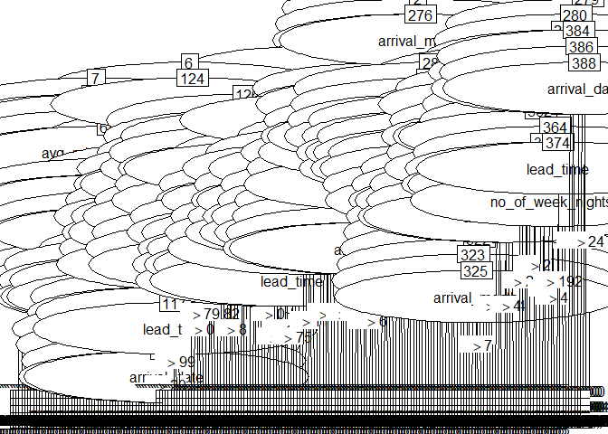
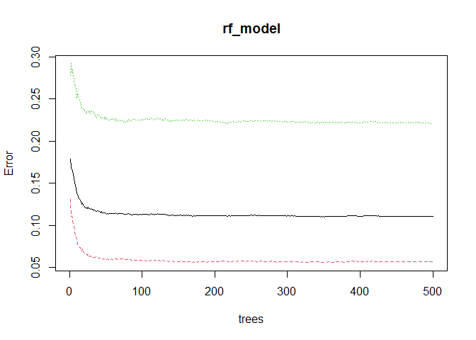
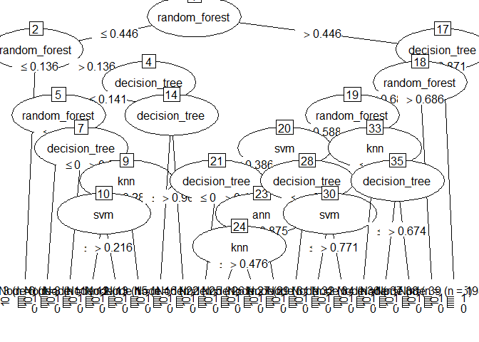
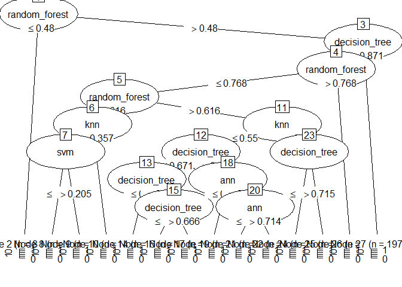
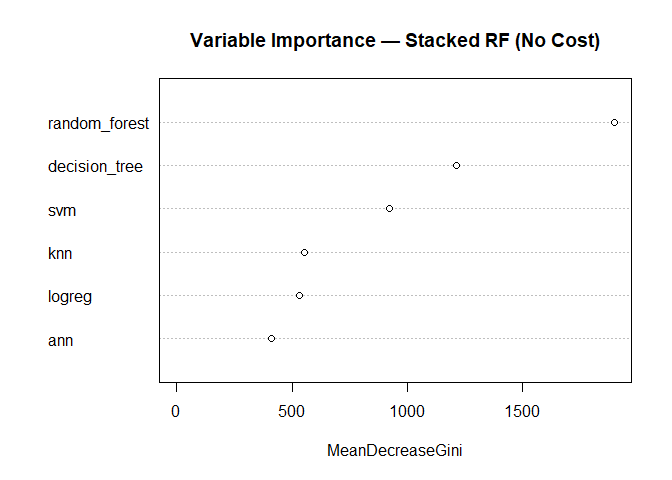
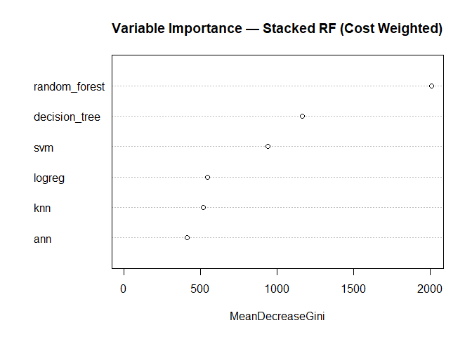

Final Project Draft of Code
================
Third Time’s the Charm
2025-10-23

## Step 0: Why?

**Dataset Chosen:**  
Hotel Reservations (~35,000 rows)  
Predicts hotel booking cancellations and potential no-shows. The
business use case focuses on **optimizing overbooking decisions** to
maximize hotel occupancy and revenue.

### Scenario: Meet Ron, the Hotel Manager

Ron is the general manager of a mid-sized city hotel that operates near
full capacity during most of the year. Recently, Ron has been facing a
major operational headache: **cancellations and overbookings are
wrecking his occupancy numbers**. Some nights he ends up with 20 empty
rooms because too many guests canceled at the last minute. Other nights,
he slightly overbooks to compensate—but the wrong guests show up,
forcing him to **walk** customers to nearby hotels, costing him money
and damaging his reputation.

Ron’s front desk staff is frustrated, customer complaints are rising,
and corporate has asked him to “tighten up” revenue performance. What
Ron needs is a **predictive system**—something that can tell him,
*“Which bookings are most likely to cancel?”* so he can safely overbook
when appropriate, avoid walking guests, and recover revenue that would
otherwise be lost.

This is the exact business problem our project solves.

### Context (from Kaggle)

> “The online hotel reservation channels have dramatically changed
> booking possibilities and customers’ behavior. A significant number of
> hotel reservations are called-off due to cancellations or no-shows.
> The typical reasons for cancellations include change of plans,
> scheduling conflicts, etc. This is often made easier by the option to
> do so free of charge or preferably at a low cost which is beneficial
> to hotel guests but it is a less desirable and possibly
> revenue-diminishing factor for hotels to deal with.”

### Business Use Case

We are building a model to predict which hotel reservations are most
likely to cancel.  
Although cancellations often result from a change of plans or scheduling
conflicts, they impose a direct financial cost on the hotel.  
To mitigate these losses and **maintain 100% occupancy**, the hotel can
strategically **overbook** based on model predictions of cancellation
likelihood.

**Main Question:**  
Can we predict which hotel reservations are most likely to be canceled,
and use these predictions to make more profitable overbooking decisions?

**Why it’s answerable with this dataset:**  
- The dataset includes **booking-level data** for over 35 000
reservations with both categorical and numerical features (lead time,
room type, guest history, etc.).  
- The dependent variable `booking_status` is binary (Canceled / Not
Canceled), making it well-suited for **classification via logistic
regression**.  
- With exploratory cleaning and modeling, we can estimate how much
predictive signal exists and whether cancellation behavior is
predictable enough to support overbooking decisions.

### Financial Assumptions

- **Revenue per booked room:** \$250 per night on average price in a
  city (source:
  <https://www.coohom.com/article/how-much-do-hotel-rooms-cost>)
- **Cancellations:** Guests can cancel free of charge at any time; each
  cancellation results in a \$250 revenue loss (from the cost of the
  room)  
- **Overbooking cost:** If the hotel overbooks and cannot accommodate a
  guest (because no cancellations occur), it incurs \$500 per night
  because the cost of walking a guest is ~2x the room cost in
  re-accommodation, transportation, goodwill, and/or compensation costs.
  (souce:
  <https://ecornell-impact.cornell.edu/the-cheapest-and-best-approach-to-overbooking/>)
- **Variable costs per room:** Considered sunk and excluded from
  analysis (the cost of turning a room is identical regardless of
  occupancy).  
- **No difference** between cancellation and no-show costs.

### Cost–Benefit Matrix

| Case | Model Prediction | Actual Outcome | Financial Impact |
|----|----|----|----|
| **True Positive (TP)** | “Will Cancel” | Guest cancels | **+ \$250** (revenue from replacement guest) |
| **True Negative (TN)** | “Will Not Cancel” | Guest does not cancel | **\$0** (no change in revenue) |
| **False Negative (FN)** | “Will Not Cancel” | Guest cancels | **– \$250** (lost booking revenue) |
| **False Positive (FP)** | “Will Cancel” | Guest shows up | **– \$500** (overbooking penalty) |

### Objective

Develop a predictive model that helps hotels **balance the trade-off**
between overbooking risk and lost revenue due to cancellations, thereby
maximizing **expected net revenue** and improving operational
decision-making.

### Step 0.5: Load Packages

``` r
library(caret)
```

    ## Loading required package: ggplot2

    ## Loading required package: lattice

``` r
library(neuralnet)
library(class)
library(C50)
library(ggplot2)
library(randomForest)
```

    ## Warning: package 'randomForest' was built under R version 4.5.2

    ## randomForest 4.7-1.2

    ## Type rfNews() to see new features/changes/bug fixes.

    ## 
    ## Attaching package: 'randomForest'

    ## The following object is masked from 'package:ggplot2':
    ## 
    ##     margin

``` r
library(kernlab)
```

    ## 
    ## Attaching package: 'kernlab'

    ## The following object is masked from 'package:ggplot2':
    ## 
    ##     alpha

## Step 1: Load Data

``` r
hotel <- read.csv("Hotel Reservations.csv", stringsAsFactors = TRUE)
```

## Step 2: Clean Data

``` r
str(hotel)
```

    ## 'data.frame':    36275 obs. of  19 variables:
    ##  $ Booking_ID                          : Factor w/ 36275 levels "INN00001","INN00002",..: 1 2 3 4 5 6 7 8 9 10 ...
    ##  $ no_of_adults                        : int  2 2 1 2 2 2 2 2 3 2 ...
    ##  $ no_of_children                      : int  0 0 0 0 0 0 0 0 0 0 ...
    ##  $ no_of_weekend_nights                : int  1 2 2 0 1 0 1 1 0 0 ...
    ##  $ no_of_week_nights                   : int  2 3 1 2 1 2 3 3 4 5 ...
    ##  $ type_of_meal_plan                   : Factor w/ 4 levels "Meal Plan 1",..: 1 4 1 1 4 2 1 1 1 1 ...
    ##  $ required_car_parking_space          : int  0 0 0 0 0 0 0 0 0 0 ...
    ##  $ room_type_reserved                  : Factor w/ 7 levels "Room_Type 1",..: 1 1 1 1 1 1 1 4 1 4 ...
    ##  $ lead_time                           : int  224 5 1 211 48 346 34 83 121 44 ...
    ##  $ arrival_year                        : int  2017 2018 2018 2018 2018 2018 2017 2018 2018 2018 ...
    ##  $ arrival_month                       : int  10 11 2 5 4 9 10 12 7 10 ...
    ##  $ arrival_date                        : int  2 6 28 20 11 13 15 26 6 18 ...
    ##  $ market_segment_type                 : Factor w/ 5 levels "Aviation","Complementary",..: 4 5 5 5 5 5 5 5 4 5 ...
    ##  $ repeated_guest                      : int  0 0 0 0 0 0 0 0 0 0 ...
    ##  $ no_of_previous_cancellations        : int  0 0 0 0 0 0 0 0 0 0 ...
    ##  $ no_of_previous_bookings_not_canceled: int  0 0 0 0 0 0 0 0 0 0 ...
    ##  $ avg_price_per_room                  : num  65 106.7 60 100 94.5 ...
    ##  $ no_of_special_requests              : int  0 1 0 0 0 1 1 1 1 3 ...
    ##  $ booking_status                      : Factor w/ 2 levels "Canceled","Not_Canceled": 2 2 1 1 1 1 2 2 2 2 ...

``` r
summary(hotel)
```

    ##     Booking_ID     no_of_adults   no_of_children    no_of_weekend_nights
    ##  INN00001:    1   Min.   :0.000   Min.   : 0.0000   Min.   :0.0000      
    ##  INN00002:    1   1st Qu.:2.000   1st Qu.: 0.0000   1st Qu.:0.0000      
    ##  INN00003:    1   Median :2.000   Median : 0.0000   Median :1.0000      
    ##  INN00004:    1   Mean   :1.845   Mean   : 0.1053   Mean   :0.8107      
    ##  INN00005:    1   3rd Qu.:2.000   3rd Qu.: 0.0000   3rd Qu.:2.0000      
    ##  INN00006:    1   Max.   :4.000   Max.   :10.0000   Max.   :7.0000      
    ##  (Other) :36269                                                         
    ##  no_of_week_nights    type_of_meal_plan required_car_parking_space
    ##  Min.   : 0.000    Meal Plan 1 :27835   Min.   :0.00000           
    ##  1st Qu.: 1.000    Meal Plan 2 : 3305   1st Qu.:0.00000           
    ##  Median : 2.000    Meal Plan 3 :    5   Median :0.00000           
    ##  Mean   : 2.204    Not Selected: 5130   Mean   :0.03099           
    ##  3rd Qu.: 3.000                         3rd Qu.:0.00000           
    ##  Max.   :17.000                         Max.   :1.00000           
    ##                                                                   
    ##    room_type_reserved   lead_time       arrival_year  arrival_month   
    ##  Room_Type 1:28130    Min.   :  0.00   Min.   :2017   Min.   : 1.000  
    ##  Room_Type 2:  692    1st Qu.: 17.00   1st Qu.:2018   1st Qu.: 5.000  
    ##  Room_Type 3:    7    Median : 57.00   Median :2018   Median : 8.000  
    ##  Room_Type 4: 6057    Mean   : 85.23   Mean   :2018   Mean   : 7.424  
    ##  Room_Type 5:  265    3rd Qu.:126.00   3rd Qu.:2018   3rd Qu.:10.000  
    ##  Room_Type 6:  966    Max.   :443.00   Max.   :2018   Max.   :12.000  
    ##  Room_Type 7:  158                                                    
    ##   arrival_date     market_segment_type repeated_guest   
    ##  Min.   : 1.0   Aviation     :  125    Min.   :0.00000  
    ##  1st Qu.: 8.0   Complementary:  391    1st Qu.:0.00000  
    ##  Median :16.0   Corporate    : 2017    Median :0.00000  
    ##  Mean   :15.6   Offline      :10528    Mean   :0.02564  
    ##  3rd Qu.:23.0   Online       :23214    3rd Qu.:0.00000  
    ##  Max.   :31.0                          Max.   :1.00000  
    ##                                                         
    ##  no_of_previous_cancellations no_of_previous_bookings_not_canceled
    ##  Min.   : 0.00000             Min.   : 0.0000                     
    ##  1st Qu.: 0.00000             1st Qu.: 0.0000                     
    ##  Median : 0.00000             Median : 0.0000                     
    ##  Mean   : 0.02335             Mean   : 0.1534                     
    ##  3rd Qu.: 0.00000             3rd Qu.: 0.0000                     
    ##  Max.   :13.00000             Max.   :58.0000                     
    ##                                                                   
    ##  avg_price_per_room no_of_special_requests      booking_status 
    ##  Min.   :  0.00     Min.   :0.0000         Canceled    :11885  
    ##  1st Qu.: 80.30     1st Qu.:0.0000         Not_Canceled:24390  
    ##  Median : 99.45     Median :0.0000                             
    ##  Mean   :103.42     Mean   :0.6197                             
    ##  3rd Qu.:120.00     3rd Qu.:1.0000                             
    ##  Max.   :540.00     Max.   :5.0000                             
    ## 

Let’s remove booking id. Let’s also convert our dependent variable
(booking status) into 0s and 1s.

``` r
hotel$Booking_ID = NULL
hotel$booking_status <- ifelse(hotel$booking_status == "Canceled", 1, 0)
str(hotel)
```

    ## 'data.frame':    36275 obs. of  18 variables:
    ##  $ no_of_adults                        : int  2 2 1 2 2 2 2 2 3 2 ...
    ##  $ no_of_children                      : int  0 0 0 0 0 0 0 0 0 0 ...
    ##  $ no_of_weekend_nights                : int  1 2 2 0 1 0 1 1 0 0 ...
    ##  $ no_of_week_nights                   : int  2 3 1 2 1 2 3 3 4 5 ...
    ##  $ type_of_meal_plan                   : Factor w/ 4 levels "Meal Plan 1",..: 1 4 1 1 4 2 1 1 1 1 ...
    ##  $ required_car_parking_space          : int  0 0 0 0 0 0 0 0 0 0 ...
    ##  $ room_type_reserved                  : Factor w/ 7 levels "Room_Type 1",..: 1 1 1 1 1 1 1 4 1 4 ...
    ##  $ lead_time                           : int  224 5 1 211 48 346 34 83 121 44 ...
    ##  $ arrival_year                        : int  2017 2018 2018 2018 2018 2018 2017 2018 2018 2018 ...
    ##  $ arrival_month                       : int  10 11 2 5 4 9 10 12 7 10 ...
    ##  $ arrival_date                        : int  2 6 28 20 11 13 15 26 6 18 ...
    ##  $ market_segment_type                 : Factor w/ 5 levels "Aviation","Complementary",..: 4 5 5 5 5 5 5 5 4 5 ...
    ##  $ repeated_guest                      : int  0 0 0 0 0 0 0 0 0 0 ...
    ##  $ no_of_previous_cancellations        : int  0 0 0 0 0 0 0 0 0 0 ...
    ##  $ no_of_previous_bookings_not_canceled: int  0 0 0 0 0 0 0 0 0 0 ...
    ##  $ avg_price_per_room                  : num  65 106.7 60 100 94.5 ...
    ##  $ no_of_special_requests              : int  0 1 0 0 0 1 1 1 1 3 ...
    ##  $ booking_status                      : num  0 0 1 1 1 1 0 0 0 0 ...

``` r
summary(hotel)
```

    ##   no_of_adults   no_of_children    no_of_weekend_nights no_of_week_nights
    ##  Min.   :0.000   Min.   : 0.0000   Min.   :0.0000       Min.   : 0.000   
    ##  1st Qu.:2.000   1st Qu.: 0.0000   1st Qu.:0.0000       1st Qu.: 1.000   
    ##  Median :2.000   Median : 0.0000   Median :1.0000       Median : 2.000   
    ##  Mean   :1.845   Mean   : 0.1053   Mean   :0.8107       Mean   : 2.204   
    ##  3rd Qu.:2.000   3rd Qu.: 0.0000   3rd Qu.:2.0000       3rd Qu.: 3.000   
    ##  Max.   :4.000   Max.   :10.0000   Max.   :7.0000       Max.   :17.000   
    ##                                                                          
    ##     type_of_meal_plan required_car_parking_space   room_type_reserved
    ##  Meal Plan 1 :27835   Min.   :0.00000            Room_Type 1:28130   
    ##  Meal Plan 2 : 3305   1st Qu.:0.00000            Room_Type 2:  692   
    ##  Meal Plan 3 :    5   Median :0.00000            Room_Type 3:    7   
    ##  Not Selected: 5130   Mean   :0.03099            Room_Type 4: 6057   
    ##                       3rd Qu.:0.00000            Room_Type 5:  265   
    ##                       Max.   :1.00000            Room_Type 6:  966   
    ##                                                  Room_Type 7:  158   
    ##    lead_time       arrival_year  arrival_month     arrival_date 
    ##  Min.   :  0.00   Min.   :2017   Min.   : 1.000   Min.   : 1.0  
    ##  1st Qu.: 17.00   1st Qu.:2018   1st Qu.: 5.000   1st Qu.: 8.0  
    ##  Median : 57.00   Median :2018   Median : 8.000   Median :16.0  
    ##  Mean   : 85.23   Mean   :2018   Mean   : 7.424   Mean   :15.6  
    ##  3rd Qu.:126.00   3rd Qu.:2018   3rd Qu.:10.000   3rd Qu.:23.0  
    ##  Max.   :443.00   Max.   :2018   Max.   :12.000   Max.   :31.0  
    ##                                                                 
    ##     market_segment_type repeated_guest    no_of_previous_cancellations
    ##  Aviation     :  125    Min.   :0.00000   Min.   : 0.00000            
    ##  Complementary:  391    1st Qu.:0.00000   1st Qu.: 0.00000            
    ##  Corporate    : 2017    Median :0.00000   Median : 0.00000            
    ##  Offline      :10528    Mean   :0.02564   Mean   : 0.02335            
    ##  Online       :23214    3rd Qu.:0.00000   3rd Qu.: 0.00000            
    ##                         Max.   :1.00000   Max.   :13.00000            
    ##                                                                       
    ##  no_of_previous_bookings_not_canceled avg_price_per_room no_of_special_requests
    ##  Min.   : 0.0000                      Min.   :  0.00     Min.   :0.0000        
    ##  1st Qu.: 0.0000                      1st Qu.: 80.30     1st Qu.:0.0000        
    ##  Median : 0.0000                      Median : 99.45     Median :0.0000        
    ##  Mean   : 0.1534                      Mean   :103.42     Mean   :0.6197        
    ##  3rd Qu.: 0.0000                      3rd Qu.:120.00     3rd Qu.:1.0000        
    ##  Max.   :58.0000                      Max.   :540.00     Max.   :5.0000        
    ##                                                                                
    ##  booking_status  
    ##  Min.   :0.0000  
    ##  1st Qu.:0.0000  
    ##  Median :0.0000  
    ##  Mean   :0.3276  
    ##  3rd Qu.:1.0000  
    ##  Max.   :1.0000  
    ## 

## Step 3: Split Data

We have 36000 data entries. In order to build a second level model, we
are going to keep 50% for evaluation. Let’s dummify, scale, and split
the data.

``` r
hotel_dummies <- as.data.frame(model.matrix(~ . - booking_status - 1, data = hotel))
hotel_dummies$booking_status <- hotel$booking_status

trainprop <- 0.5
set.seed(12345)
trainrows <- sample(1:nrow(hotel_dummies), trainprop * nrow(hotel_dummies))

minmax <- function(x) {
  if (is.numeric(x)) {
    return((x - min(x)) / (max(x) - min(x)))
  } else {
    return(x)
  }
}
hotel_scaled <- as.data.frame(lapply(hotel_dummies, minmax))

hotel_train <- hotel_dummies[trainrows, ]
hotel_test  <- hotel_dummies[-trainrows, ]

hotel_train_scaled <- hotel_scaled[trainrows, ]
hotel_test_scaled <- hotel_scaled[-trainrows, ]
str(hotel_train)
```

    ## 'data.frame':    18137 obs. of  29 variables:
    ##  $ no_of_adults                        : num  2 2 2 2 2 1 3 1 1 2 ...
    ##  $ no_of_children                      : num  0 0 0 0 0 0 0 0 0 0 ...
    ##  $ no_of_weekend_nights                : num  2 2 1 2 1 0 1 0 1 0 ...
    ##  $ no_of_week_nights                   : num  3 2 0 3 2 2 2 1 2 3 ...
    ##  $ type_of_meal_planMeal Plan 1        : num  1 0 1 1 1 1 1 1 1 1 ...
    ##  $ type_of_meal_planMeal Plan 2        : num  0 0 0 0 0 0 0 0 0 0 ...
    ##  $ type_of_meal_planMeal Plan 3        : num  0 0 0 0 0 0 0 0 0 0 ...
    ##  $ type_of_meal_planNot Selected       : num  0 1 0 0 0 0 0 0 0 0 ...
    ##  $ required_car_parking_space          : num  0 0 0 0 0 0 0 0 0 0 ...
    ##  $ room_type_reservedRoom_Type 2       : num  0 0 0 0 0 0 0 0 0 0 ...
    ##  $ room_type_reservedRoom_Type 3       : num  0 0 0 0 0 0 0 0 0 0 ...
    ##  $ room_type_reservedRoom_Type 4       : num  0 0 1 1 0 0 1 1 0 0 ...
    ##  $ room_type_reservedRoom_Type 5       : num  0 0 0 0 0 0 0 0 0 0 ...
    ##  $ room_type_reservedRoom_Type 6       : num  0 0 0 0 0 0 0 0 0 0 ...
    ##  $ room_type_reservedRoom_Type 7       : num  0 0 0 0 0 0 0 0 0 0 ...
    ##  $ lead_time                           : num  12 161 30 34 233 19 103 1 118 73 ...
    ##  $ arrival_year                        : num  2018 2018 2018 2017 2018 ...
    ##  $ arrival_month                       : num  11 7 9 10 10 6 12 1 6 11 ...
    ##  $ arrival_date                        : num  10 16 11 25 14 22 19 30 6 26 ...
    ##  $ market_segment_typeComplementary    : num  0 0 0 0 0 0 0 0 0 0 ...
    ##  $ market_segment_typeCorporate        : num  0 0 0 0 0 1 0 0 0 0 ...
    ##  $ market_segment_typeOffline          : num  0 0 0 1 1 0 0 1 1 1 ...
    ##  $ market_segment_typeOnline           : num  1 1 1 0 0 0 1 0 0 0 ...
    ##  $ repeated_guest                      : num  0 0 0 0 0 0 0 0 0 0 ...
    ##  $ no_of_previous_cancellations        : num  0 0 0 0 0 0 0 0 0 0 ...
    ##  $ no_of_previous_bookings_not_canceled: num  0 0 0 0 0 0 0 0 0 0 ...
    ##  $ avg_price_per_room                  : num  90.1 87.1 149.4 75 90 ...
    ##  $ no_of_special_requests              : num  1 1 1 0 0 0 1 0 0 0 ...
    ##  $ booking_status                      : num  0 0 0 0 1 0 1 0 0 0 ...

## Step 4: Build Models

### Step 4.1: Build LogReg Model

Our baseline model will be a **vanilla Logistic Regression (LogReg)**,
which predicts the probability of a booking being canceled.  
This serves as the foundation for comparison with future models (e.g.,
neural networks, decision trees, etc.).

``` r
logreg_model <- glm(booking_status ~ ., data = hotel_train, family = "binomial")
```

    ## Warning: glm.fit: fitted probabilities numerically 0 or 1 occurred

Let’s also build an enhanced model. To improve the predictive
performance of our baseline logistic regression model, we introduce
several **interaction terms**. These interactions allow the model to
capture relationships between variables that jointly influence
cancellation behavior. Including these terms helps the model represent
more complex customer patterns that cannot be captured by individual
predictors alone.

#### **1. `lead_time × avg_price_per_room`**

This interaction captures how the impact of lead time changes depending
on room price. - Customers who book **high-priced rooms far in advance**
may be more likely to cancel as plans, budgets, or alternatives
change. - Customers booking inexpensive rooms far in advance may behave
differently. This term allows the model to account for situations where
**price modifies the effect of lead time** on cancellations.

#### **2. `no_of_special_requests × repeated_guest`**

This interaction differentiates behavior between repeat guests and
first-time customers. - Repeat guests with many special requests may be
more committed (e.g., loyal or planned stays). - First-time guests with
many requests may be more likely to cancel if expectations shift. This
term helps the model identify how **customer loyalty interacts with
booking complexity**.

#### **3. `no_of_weekend_nights × no_of_week_nights`**

This interaction captures the structure of the guest’s stay. - Longer,
more complex trips (spanning both weekend and weekday nights) may carry
higher cancellation risks. This term helps the model evaluate how the
**overall length and nature of the stay** influence cancellation
behavior.

#### **4. `arrival_month × market_segment_type` (applied across dummy variables)**

After dummification, `market_segment_type` becomes several binary
indicators (e.g., Online, Offline, Corporate).  
Interacting `arrival_month` with each segment dummy allows the model to
learn **segment-specific seasonal cancellation patterns**: - Corporate
travelers may cancel more during holiday months. - Online/OTA bookings
often surge—and cancel more—during peak travel seasons or promotional
periods. - Offline bookings (e.g., via agents) may follow entirely
different seasonal trends.  
By including these interactions, the model captures how **seasonality
modifies cancellation behavior across different booking channels**.

``` r
logreg_model_enhanced <- glm(
  booking_status ~ 
    . +
    lead_time * avg_price_per_room +
    no_of_special_requests * repeated_guest +
    no_of_weekend_nights * no_of_week_nights +
    arrival_month * market_segment_typeComplementary +
    arrival_month * market_segment_typeCorporate +
    arrival_month * market_segment_typeOffline +
    arrival_month * market_segment_typeOnline,
  data = hotel_train,
  family = "binomial"
)
```

    ## Warning: glm.fit: fitted probabilities numerically 0 or 1 occurred

### Step 4.2: Build KNN Model

Here, we separate our predictors and target variables into training and
testing sets. We will predict and evaluate in step 5.

``` r
train_features <- subset(hotel_train_scaled, select = -booking_status)
train_labels <- hotel_train_scaled$booking_status
test_features <- subset(hotel_test_scaled, select = -booking_status)
test_labels <- hotel_test_scaled$booking_status
```

### Step 4.3: Build ANN Model

We are now building an ANN model with a hidden layer of 5 neurons. With
structured data, typically a shallow network can capture enough valuable
relationships.

``` r
ann_model <- neuralnet(
  booking_status ~ .,
  data = hotel_train_scaled,
  lifesign = "full",
  stepmax = 1e6,
  hidden = 2
)
```

    ## hidden: 2    thresh: 0.01    rep: 1/1    steps:    1000  min thresh: 2.77619757106633
    ##                                                    2000  min thresh: 1.24621973765806
    ##                                                    3000  min thresh: 0.813334161499235
    ##                                                    4000  min thresh: 0.453133568112846
    ##                                                    5000  min thresh: 0.453133568112846
    ##                                                    6000  min thresh: 0.453133568112846
    ##                                                    7000  min thresh: 0.453133568112846
    ##                                                    8000  min thresh: 0.453133568112846
    ##                                                    9000  min thresh: 0.453133568112846
    ##                                                   10000  min thresh: 0.453133568112846
    ##                                                   11000  min thresh: 0.453133568112846
    ##                                                   12000  min thresh: 0.453133568112846
    ##                                                   13000  min thresh: 0.453133568112846
    ##                                                   14000  min thresh: 0.453133568112846
    ##                                                   15000  min thresh: 0.453133568112846
    ##                                                   16000  min thresh: 0.453133568112846
    ##                                                   17000  min thresh: 0.366369600688719
    ##                                                   18000  min thresh: 0.189806090882579
    ##                                                   19000  min thresh: 0.189806090882579
    ##                                                   20000  min thresh: 0.145845211076629
    ##                                                   21000  min thresh: 0.117723567222123
    ##                                                   22000  min thresh: 0.0979128972402126
    ##                                                   23000  min thresh: 0.0979128972402126
    ##                                                   24000  min thresh: 0.0851758762127452
    ##                                                   25000  min thresh: 0.0712565019999547
    ##                                                   26000  min thresh: 0.0595544191077528
    ##                                                   27000  min thresh: 0.0595544191077528
    ##                                                   28000  min thresh: 0.0522258875362938
    ##                                                   29000  min thresh: 0.0325645576693234
    ##                                                   30000  min thresh: 0.0325645576693234
    ##                                                   31000  min thresh: 0.0325645576693234
    ##                                                   32000  min thresh: 0.0325645576693234
    ##                                                   33000  min thresh: 0.0325645576693234
    ##                                                   34000  min thresh: 0.0325645576693234
    ##                                                   35000  min thresh: 0.0292125576968254
    ##                                                   36000  min thresh: 0.0292125576968254
    ##                                                   37000  min thresh: 0.0225684392587399
    ##                                                   38000  min thresh: 0.0225684392587399
    ##                                                   39000  min thresh: 0.0225684392587399
    ##                                                   40000  min thresh: 0.0225684392587399
    ##                                                   41000  min thresh: 0.0225684392587399
    ##                                                   42000  min thresh: 0.0217580679210169
    ##                                                   43000  min thresh: 0.0188461749518951
    ##                                                   44000  min thresh: 0.0188461749518951
    ##                                                   45000  min thresh: 0.0188461749518951
    ##                                                   46000  min thresh: 0.0188461749518951
    ##                                                   47000  min thresh: 0.0188461749518951
    ##                                                   48000  min thresh: 0.0188461749518951
    ##                                                   49000  min thresh: 0.0188461749518951
    ##                                                   50000  min thresh: 0.0188461749518951
    ##                                                   51000  min thresh: 0.017452353570895
    ##                                                   52000  min thresh: 0.017452353570895
    ##                                                   53000  min thresh: 0.017452353570895
    ##                                                   54000  min thresh: 0.017452353570895
    ##                                                   55000  min thresh: 0.017452353570895
    ##                                                   56000  min thresh: 0.017452353570895
    ##                                                   57000  min thresh: 0.017452353570895
    ##                                                   58000  min thresh: 0.0155454114417829
    ##                                                   59000  min thresh: 0.0144731067482335
    ##                                                   60000  min thresh: 0.0144731067482335
    ##                                                   61000  min thresh: 0.0144731067482335
    ##                                                   62000  min thresh: 0.0140739959599545
    ##                                                   63000  min thresh: 0.0131281079695655
    ##                                                   64000  min thresh: 0.0131281079695655
    ##                                                   65000  min thresh: 0.0131281079695655
    ##                                                   66000  min thresh: 0.0129144605859179
    ##                                                   67000  min thresh: 0.0129144605859179
    ##                                                   68000  min thresh: 0.0129144605859179
    ##                                                   69000  min thresh: 0.0126004143542452
    ##                                                   69826  error: 1205.15052   time: 13.68 mins

``` r
plot(ann_model)
```

### Step 4.4: Build Decision Tree Model

We will now build a normal decision tree model. We will not impose a
cost matrix here but we will in the second level decision tree.

``` r
m_decision <- C5.0(
  as.factor(booking_status) ~ .,
  data = hotel_train
)

plot(m_decision)
```

<!-- -->

``` r
summary(m_decision)
```

    ## 
    ## Call:
    ## C5.0.formula(formula = as.factor(booking_status) ~ ., data = hotel_train)
    ## 
    ## 
    ## C5.0 [Release 2.07 GPL Edition]      Tue Dec  2 18:03:42 2025
    ## -------------------------------
    ## 
    ## Class specified by attribute `outcome'
    ## 
    ## Read 18137 cases (29 attributes) from undefined.data
    ## 
    ## Decision tree:
    ## 
    ## lead_time > 151:
    ## :...no_of_special_requests > 2: 0 (51)
    ## :   no_of_special_requests <= 2:
    ## :   :...avg_price_per_room > 100:
    ## :       :...arrival_month <= 11: 1 (1487)
    ## :       :   arrival_month > 11:
    ## :       :   :...no_of_special_requests <= 0: 0 (42)
    ## :       :       no_of_special_requests > 0:
    ## :       :       :...arrival_date <= 24: 0 (5)
    ## :       :           arrival_date > 24: 1 (13/4)
    ## :       avg_price_per_room <= 100:
    ## :       :...type_of_meal_planMeal Plan 2 > 0:
    ## :           :...arrival_month <= 9: 0 (103/8)
    ## :           :   arrival_month > 9:
    ## :           :   :...no_of_week_nights <= 1: 0 (4/1)
    ## :           :       no_of_week_nights > 1: 1 (12/1)
    ## :           type_of_meal_planMeal Plan 2 <= 0:
    ## :           :...no_of_special_requests > 0:
    ## :               :...no_of_weekend_nights <= 0:
    ## :               :   :...lead_time <= 180: 0 (45/5)
    ## :               :   :   lead_time > 180:
    ## :               :   :   :...market_segment_typeOffline > 0:
    ## :               :   :       :...no_of_adults <= 2: 0 (11)
    ## :               :   :       :   no_of_adults > 2: 1 (2)
    ## :               :   :       market_segment_typeOffline <= 0:
    ## :               :   :       :...arrival_month <= 11: 1 (78)
    ## :               :   :           arrival_month > 11:
    ## :               :   :           :...lead_time > 277: 1 (4)
    ## :               :   :               lead_time <= 277:
    ## :               :   :               :...lead_time <= 222: 1 (2)
    ## :               :   :                   lead_time > 222: 0 (6)
    ## :               :   no_of_weekend_nights > 0:
    ## :               :   :...arrival_month > 11: 1 (39/18)
    ## :               :       arrival_month <= 11:
    ## :               :       :...type_of_meal_planMeal Plan 1 > 0: 0 (286/36)
    ## :               :           type_of_meal_planMeal Plan 1 <= 0:
    ## :               :           :...no_of_adults <= 1: 0 (4)
    ## :               :               no_of_adults > 1:
    ## :               :               :...avg_price_per_room > 93.56:
    ## :               :                   :...lead_time <= 192: 1 (7)
    ## :               :                   :   lead_time > 192: 0 (6/2)
    ## :               :                   avg_price_per_room <= 93.56:
    ## :               :                   :...no_of_special_requests <= 1:
    ## :               :                       :...no_of_week_nights <= 0: 1 (2)
    ## :               :                       :   no_of_week_nights > 0: 0 (31/3)
    ## :               :                       no_of_special_requests > 1:
    ## :               :                       :...no_of_weekend_nights <= 1: 0 (6)
    ## :               :                           no_of_weekend_nights > 1:
    ## :               :                           :...no_of_week_nights <= 4: 1 (5)
    ## :               :                               no_of_week_nights > 4: 0 (2)
    ## :               no_of_special_requests <= 0:
    ## :               :...market_segment_typeOffline <= 0:
    ## :                   :...no_of_adults > 1: 1 (395)
    ## :                   :   no_of_adults <= 1:
    ## :                   :   :...avg_price_per_room > 68: 1 (33/1)
    ## :                   :       avg_price_per_room <= 68:
    ## :                   :       :...no_of_adults <= 0: 1 (2)
    ## :                   :           no_of_adults > 0: 0 (8/1)
    ## :                   market_segment_typeOffline > 0:
    ## :                   :...arrival_month > 11: 0 (56)
    ## :                       arrival_month <= 11:
    ## :                       :...no_of_adults <= 1:
    ## :                           :...no_of_weekend_nights > 1:
    ## :                           :   :...avg_price_per_room <= 89.14: 0 (9/1)
    ## :                           :   :   avg_price_per_room > 89.14: 1 (14)
    ## :                           :   no_of_weekend_nights <= 1:
    ## :                           :   :...lead_time <= 335: 0 (156/10)
    ## :                           :       lead_time > 335:
    ## :                           :       :...lead_time <= 338: 0 (2)
    ## :                           :           lead_time > 338: 1 (8/1)
    ## :                           no_of_adults > 1:
    ## :                           :...arrival_year <= 2017:
    ## :                               :...lead_time > 198: 0 (59)
    ## :                               :   lead_time <= 198:
    ## :                               :   :...lead_time <= 168: 0 (5/1)
    ## :                               :       lead_time > 168: 1 (25)
    ## :                               arrival_year > 2017:
    ## :                               :...lead_time <= 203:
    ## :                                   :...avg_price_per_room <= 81.76: 0 (60/7)
    ## :                                   :   avg_price_per_room > 81.76:
    ## :                                   :   :...avg_price_per_room <= 90.45: 1 (27/2)
    ## :                                   :       avg_price_per_room > 90.45:
    ## :                                   :       :...arrival_date <= 5: 1 (8)
    ## :                                   :           arrival_date > 5: 0 (10)
    ## :                                   lead_time > 203:
    ## :                                   :...no_of_weekend_nights > 1:
    ## :                                       :...arrival_month > 8: 0 (10/1)
    ## :                                       :   arrival_month <= 8:
    ## :                                       :   :...no_of_week_nights > 4: 0 (2)
    ## :                                       :       no_of_week_nights <= 4:
    ## :                                       :       :...arrival_month <= 4: 0 (4/1)
    ## :                                       :           arrival_month > 4: 1 (29/4)
    ## :                                       no_of_weekend_nights <= 1:
    ## :                                       :...no_of_week_nights > 3:
    ## :                                           :...arrival_date <= 18: 1 (26)
    ## :                                           :   arrival_date > 18: [S1]
    ## :                                           no_of_week_nights <= 3:
    ## :                                           :...arrival_month > 10: 1 (96)
    ## :                                               arrival_month <= 10: [S2]
    ## lead_time <= 151:
    ## :...no_of_week_nights > 8:
    ##     :...arrival_month <= 1: 0 (4)
    ##     :   arrival_month > 1: 1 (49/4)
    ##     no_of_week_nights <= 8:
    ##     :...repeated_guest > 0: 0 (443/3)
    ##         repeated_guest <= 0:
    ##         :...required_car_parking_space > 0: 0 (433/5)
    ##             required_car_parking_space <= 0:
    ##             :...no_of_special_requests > 0:
    ##                 :...no_of_special_requests > 1:
    ##                 :   :...lead_time <= 90: 0 (1601/27)
    ##                 :   :   lead_time > 90:
    ##                 :   :   :...arrival_month > 10:
    ##                 :   :       :...no_of_week_nights <= 0: 1 (7)
    ##                 :   :       :   no_of_week_nights > 0: 0 (86/22)
    ##                 :   :       arrival_month <= 10:
    ##                 :   :       :...arrival_year > 2017: 0 (286/34)
    ##                 :   :           arrival_year <= 2017:
    ##                 :   :           :...arrival_month <= 7: 1 (6)
    ##                 :   :               arrival_month > 7: 0 (12/2)
    ##                 :   no_of_special_requests <= 1:
    ##                 :   :...market_segment_typeOffline > 0: 0 (517/15)
    ##                 :       market_segment_typeOffline <= 0:
    ##                 :       :...lead_time <= 6: 0 (633/32)
    ##                 :           lead_time > 6:
    ##                 :           :...arrival_month > 11:
    ##                 :               :...lead_time <= 93: 0 (242/1)
    ##                 :               :   lead_time > 93: [S3]
    ##                 :               arrival_month <= 11:
    ##                 :               :...avg_price_per_room <= 118.27:
    ##                 :                   :...avg_price_per_room <= 66.49: 0 (128/5)
    ##                 :                   :   avg_price_per_room > 66.49:
    ##                 :                   :   :...avg_price_per_room <= 80.2:
    ##                 :                   :       :...arrival_year > 2017: 0 (291/66)
    ##                 :                   :       :   arrival_year <= 2017:
    ##                 :                   :       :   :...arrival_month > 7: 0 (58/18)
    ##                 :                   :       :       arrival_month <= 7: [S4]
    ##                 :                   :       avg_price_per_room > 80.2:
    ##                 :                   :       :...lead_time <= 135: 0 (1325/205)
    ##                 :                   :           lead_time > 135: [S5]
    ##                 :                   avg_price_per_room > 118.27:
    ##                 :                   :...arrival_year <= 2017: 0 (50/3)
    ##                 :                       arrival_year > 2017:
    ##                 :                       :...arrival_month <= 8:
    ##                 :                           :...arrival_month > 3: 0 (574/119)
    ##                 :                           :   arrival_month <= 3:
    ##                 :                           :   :...lead_time <= 34: 0 (35/5)
    ##                 :                           :       lead_time > 34: [S6]
    ##                 :                           arrival_month > 8:
    ##                 :                           :...no_of_week_nights > 3: 1 (57/23)
    ##                 :                               no_of_week_nights <= 3: [S7]
    ##                 no_of_special_requests <= 0:
    ##                 :...market_segment_typeOnline > 0:
    ##                     :...arrival_month <= 1: 0 (120/9)
    ##                     :   arrival_month > 1:
    ##                     :   :...lead_time <= 13:
    ##                     :       :...arrival_month > 11: 0 (114)
    ##                     :       :   arrival_month <= 11:
    ##                     :       :   :...avg_price_per_room > 196.35:
    ##                     :       :       :...avg_price_per_room <= 201.6: 0 (5/1)
    ##                     :       :       :   avg_price_per_room > 201.6: 1 (21)
    ##                     :       :       avg_price_per_room <= 196.35:
    ##                     :       :       :...lead_time <= 3:
    ##                     :       :           :...arrival_month > 5: 0 (257/19)
    ##                     :       :           :   arrival_month <= 5:
    ##                     :       :           :   :...no_of_weekend_nights > 1:
    ##                     :       :           :       :...arrival_date > 23: 1 (12)
    ##                     :       :           :       :   arrival_date <= 23: [S8]
    ##                     :       :           :       no_of_weekend_nights <= 1: [S9]
    ##                     :       :           lead_time > 3:
    ##                     :       :           :...arrival_year <= 2017: 0 (44/6)
    ##                     :       :               arrival_year > 2017: [S10]
    ##                     :       lead_time > 13:
    ##                     :       :...arrival_year <= 2017:
    ##                     :           :...lead_time <= 81: 0 (129/20)
    ##                     :           :   lead_time > 81: [S11]
    ##                     :           arrival_year > 2017:
    ##                     :           :...avg_price_per_room > 109.25: 1 (1243/308)
    ##                     :               avg_price_per_room <= 109.25:
    ##                     :               :...avg_price_per_room <= 56.52: 0 (28/3)
    ##                     :                   avg_price_per_room > 56.52:
    ##                     :                   :...type_of_meal_planMeal Plan 1 > 0:
    ##                     :                       :...no_of_adults <= 1: 1 (140/48)
    ##                     :                       :   no_of_adults > 1: [S12]
    ##                     :                       type_of_meal_planMeal Plan 1 <= 0: [S13]
    ##                     market_segment_typeOnline <= 0:
    ##                     :...lead_time <= 74:
    ##                         :...avg_price_per_room > 183.3:
    ##                         :   :...avg_price_per_room <= 201.5: 0 (19)
    ##                         :   :   avg_price_per_room > 201.5: 1 (14)
    ##                         :   avg_price_per_room <= 183.3:
    ##                         :   :...no_of_weekend_nights <= 0:
    ##                         :       :...market_segment_typeOffline > 0: 0 (1073)
    ##                         :       :   market_segment_typeOffline <= 0:
    ##                         :       :   :...room_type_reservedRoom_Type 4 <= 0:
    ##                         :       :       :...avg_price_per_room <= 130.5: 0 (364/35)
    ##                         :       :       :   avg_price_per_room > 130.5:
    ##                         :       :       :   :...lead_time <= 38: 0 (18/3)
    ##                         :       :       :       lead_time > 38: 1 (7)
    ##                         :       :       room_type_reservedRoom_Type 4 > 0:
    ##                         :       :       :...arrival_date <= 9: 0 (12)
    ##                         :       :           arrival_date > 9:
    ##                         :       :           :...no_of_adults > 1:
    ##                         :       :               :...arrival_month <= 7: 1 (10/2)
    ##                         :       :               :   arrival_month > 7: 0 (4)
    ##                         :       :               no_of_adults <= 1: [S14]
    ##                         :       no_of_weekend_nights > 0:
    ##                         :       :...lead_time > 65:
    ##                         :           :...no_of_adults <= 1: 1 (28/1)
    ##                         :           :   no_of_adults > 1:
    ##                         :           :   :...arrival_year > 2017: 0 (37/4)
    ##                         :           :       arrival_year <= 2017: [S15]
    ##                         :           lead_time <= 65:
    ##                         :           :...lead_time <= 1:
    ##                         :               :...arrival_month > 2: 0 (64/5)
    ##                         :               :   arrival_month <= 2:
    ##                         :               :   :...arrival_date <= 27: 0 (4)
    ##                         :               :       arrival_date > 27: 1 (26)
    ##                         :               lead_time > 1:
    ##                         :               :...arrival_month > 9: 0 (362/9)
    ##                         :                   arrival_month <= 9:
    ##                         :                   :...arrival_year > 2017: 0 (390/41)
    ##                         :                       arrival_year <= 2017:
    ##                         :                       :...no_of_weekend_nights > 1:
    ##                         :                           :...lead_time <= 2: 1 (6/1)
    ##                         :                           :   lead_time > 2: 0 (24/1)
    ##                         :                           no_of_weekend_nights <= 1: [S16]
    ##                         lead_time > 74:
    ##                         :...no_of_week_nights <= 0:
    ##                             :...avg_price_per_room <= 92.5: 0 (10/2)
    ##                             :   avg_price_per_room > 92.5:
    ##                             :   :...arrival_date <= 9: 0 (4/1)
    ##                             :       arrival_date > 9: 1 (41)
    ##                             no_of_week_nights > 0:
    ##                             :...arrival_month > 11: 0 (83)
    ##                                 arrival_month <= 11:
    ##                                 :...avg_price_per_room <= 58.65: 0 (32)
    ##                                     avg_price_per_room > 58.65: [S17]
    ## 
    ## SubTree [S1]
    ## 
    ## avg_price_per_room <= 70.4: 1 (9)
    ## avg_price_per_room > 70.4: 0 (13/1)
    ## 
    ## SubTree [S2]
    ## 
    ## avg_price_per_room > 94: 1 (66)
    ## avg_price_per_room <= 94:
    ## :...lead_time > 320: 1 (46)
    ##     lead_time <= 320:
    ##     :...avg_price_per_room > 90.46: 0 (4)
    ##         avg_price_per_room <= 90.46:
    ##         :...avg_price_per_room > 73.6: 1 (50/2)
    ##             avg_price_per_room <= 73.6:
    ##             :...arrival_month <= 5: 0 (4)
    ##                 arrival_month > 5:
    ##                 :...arrival_month <= 7: 1 (14/1)
    ##                     arrival_month > 7: 0 (3)
    ## 
    ## SubTree [S3]
    ## 
    ## type_of_meal_planMeal Plan 2 > 0: 1 (3)
    ## type_of_meal_planMeal Plan 2 <= 0:
    ## :...no_of_children <= 0: 0 (38/16)
    ##     no_of_children > 0: 1 (13/3)
    ## 
    ## SubTree [S4]
    ## 
    ## arrival_date <= 26: 1 (22)
    ## arrival_date > 26: 0 (6)
    ## 
    ## SubTree [S5]
    ## 
    ## no_of_weekend_nights > 1: 0 (28/4)
    ## no_of_weekend_nights <= 1:
    ## :...arrival_month <= 6: 1 (16/5)
    ##     arrival_month > 6: 0 (28/10)
    ## 
    ## SubTree [S6]
    ## 
    ## room_type_reservedRoom_Type 2 <= 0: 1 (22/5)
    ## room_type_reservedRoom_Type 2 > 0: 0 (2)
    ## 
    ## SubTree [S7]
    ## 
    ## no_of_week_nights > 1: 0 (222/80)
    ## no_of_week_nights <= 1:
    ## :...arrival_month <= 10:
    ##     :...no_of_weekend_nights <= 1: 0 (70/25)
    ##     :   no_of_weekend_nights > 1: 1 (40/17)
    ##     arrival_month > 10:
    ##     :...arrival_date <= 6: 1 (16)
    ##         arrival_date > 6: 0 (11/3)
    ## 
    ## SubTree [S8]
    ## 
    ## avg_price_per_room <= 79.82: 1 (2)
    ## avg_price_per_room > 79.82: 0 (7)
    ## 
    ## SubTree [S9]
    ## 
    ## room_type_reservedRoom_Type 4 <= 0: 0 (128/24)
    ## room_type_reservedRoom_Type 4 > 0:
    ## :...lead_time > 2: 1 (5)
    ##     lead_time <= 2:
    ##     :...avg_price_per_room > 114.33: 0 (7)
    ##         avg_price_per_room <= 114.33:
    ##         :...no_of_weekend_nights <= 0: 0 (2)
    ##             no_of_weekend_nights > 0: 1 (4)
    ## 
    ## SubTree [S10]
    ## 
    ## avg_price_per_room > 119.25: 1 (144/47)
    ## avg_price_per_room <= 119.25:
    ## :...avg_price_per_room <= 57.52: 0 (11)
    ##     avg_price_per_room > 57.52:
    ##     :...no_of_week_nights > 1: 1 (72/32)
    ##         no_of_week_nights <= 1:
    ##         :...no_of_adults <= 1: 0 (44/8)
    ##             no_of_adults > 1:
    ##             :...lead_time <= 8: 0 (36/9)
    ##                 lead_time > 8: 1 (16/5)
    ## 
    ## SubTree [S11]
    ## 
    ## type_of_meal_planMeal Plan 2 > 0: 1 (32)
    ## type_of_meal_planMeal Plan 2 <= 0:
    ## :...no_of_weekend_nights > 1: 1 (17/2)
    ##     no_of_weekend_nights <= 1:
    ##     :...arrival_month <= 7: 1 (4)
    ##         arrival_month > 7: 0 (21/7)
    ## 
    ## SubTree [S12]
    ## 
    ## avg_price_per_room > 73.92: 1 (475/219)
    ## avg_price_per_room <= 73.92:
    ## :...arrival_month <= 7: 0 (49/10)
    ##     arrival_month > 7:
    ##     :...arrival_month <= 11: 1 (6/1)
    ##         arrival_month > 11: 0 (3)
    ## 
    ## SubTree [S13]
    ## 
    ## avg_price_per_room > 102.15: 1 (69/9)
    ## avg_price_per_room <= 102.15:
    ## :...no_of_adults <= 1:
    ##     :...type_of_meal_planMeal Plan 2 <= 0: 0 (24/9)
    ##     :   type_of_meal_planMeal Plan 2 > 0: 1 (2)
    ##     no_of_adults > 1:
    ##     :...lead_time <= 27:
    ##         :...arrival_month > 11: 0 (12)
    ##         :   arrival_month <= 11:
    ##         :   :...no_of_week_nights <= 0: 0 (4)
    ##         :       no_of_week_nights > 0:
    ##         :       :...lead_time <= 24: 1 (34/10)
    ##         :           lead_time > 24: 0 (3)
    ##         lead_time > 27:
    ##         :...no_of_week_nights <= 1:
    ##             :...lead_time <= 141: 1 (93/30)
    ##             :   lead_time > 141: 0 (5/1)
    ##             no_of_week_nights > 1:
    ##             :...arrival_month > 3: 1 (123/21)
    ##                 arrival_month <= 3:
    ##                 :...lead_time <= 75: 1 (40/11)
    ##                     lead_time > 75: 0 (12/2)
    ## 
    ## SubTree [S14]
    ## 
    ## no_of_week_nights > 2: 0 (7)
    ## no_of_week_nights <= 2:
    ## :...lead_time <= 9: 0 (9/3)
    ##     lead_time > 9: 1 (4)
    ## 
    ## SubTree [S15]
    ## 
    ## no_of_weekend_nights <= 1: 1 (8/2)
    ## no_of_weekend_nights > 1: 0 (4)
    ## 
    ## SubTree [S16]
    ## 
    ## no_of_adults <= 1: 0 (4)
    ## no_of_adults > 1:
    ## :...lead_time <= 24: 1 (8)
    ##     lead_time > 24:
    ##     :...avg_price_per_room <= 54.31: 1 (2)
    ##         avg_price_per_room > 54.31: 0 (7)
    ## 
    ## SubTree [S17]
    ## 
    ## room_type_reservedRoom_Type 4 > 0: 0 (50/4)
    ## room_type_reservedRoom_Type 4 <= 0:
    ## :...avg_price_per_room <= 65.45:
    ##     :...arrival_date <= 26: 0 (34/9)
    ##     :   arrival_date > 26: 1 (27)
    ##     avg_price_per_room > 65.45:
    ##     :...arrival_month <= 2: 0 (104/2)
    ##         arrival_month > 2:
    ##         :...arrival_month <= 4:
    ##             :...lead_time > 109: 0 (38/5)
    ##             :   lead_time <= 109:
    ##             :   :...no_of_week_nights > 3: 0 (8)
    ##             :       no_of_week_nights <= 3:
    ##             :       :...lead_time > 90: 1 (64/2)
    ##             :           lead_time <= 90:
    ##             :           :...lead_time <= 78: 1 (17/1)
    ##             :               lead_time > 78: 0 (8/1)
    ##             arrival_month > 4:
    ##             :...lead_time <= 92: 0 (150/8)
    ##                 lead_time > 92:
    ##                 :...arrival_date > 29: 1 (24/2)
    ##                     arrival_date <= 29:
    ##                     :...arrival_year <= 2017:
    ##                         :...avg_price_per_room <= 108.5:
    ##                         :   :...avg_price_per_room <= 98: 0 (109/44)
    ##                         :   :   avg_price_per_room > 98: 1 (33)
    ##                         :   avg_price_per_room > 108.5:
    ##                         :   :...lead_time <= 104: 0 (31/1)
    ##                         :       lead_time > 104: 1 (6)
    ##                         arrival_year > 2017:
    ##                         :...arrival_date <= 1:
    ##                             :...no_of_adults <= 1: 1 (13)
    ##                             :   no_of_adults > 1: 0 (6/1)
    ##                             arrival_date > 1:
    ##                             :...avg_price_per_room > 114.25:
    ##                                 :...no_of_week_nights > 2: 1 (7)
    ##                                 :   no_of_week_nights <= 2:
    ##                                 :   :...lead_time <= 99: 1 (7)
    ##                                 :       lead_time > 99: 0 (18/2)
    ##                                 avg_price_per_room <= 114.25:
    ##                                 :...avg_price_per_room > 101.1: 0 (55)
    ##                                     avg_price_per_room <= 101.1:
    ##                                     :...avg_price_per_room <= 89.85: 0 (101/13)
    ##                                         avg_price_per_room > 89.85:
    ##                                         :...lead_time <= 106: 1 (6)
    ##                                             lead_time > 106:
    ##                                             :...no_of_weekend_nights <= 0:
    ##                                                 :...lead_time <= 145: 0 (21/1)
    ##                                                 :   lead_time > 145: 1 (2)
    ##                                                 no_of_weekend_nights > 0:
    ##                                                 :...arrival_date <= 20: 0 (4)
    ##                                                     arrival_date > 20: 1 (10)
    ## 
    ## 
    ## Evaluation on training data (18137 cases):
    ## 
    ##      Decision Tree   
    ##    ----------------  
    ##    Size      Errors  
    ## 
    ##     196 1946(10.7%)   <<
    ## 
    ## 
    ##     (a)   (b)    <-classified as
    ##    ----  ----
    ##   11362   845    (a): class 0
    ##    1101  4829    (b): class 1
    ## 
    ## 
    ##  Attribute usage:
    ## 
    ##  100.00% lead_time
    ##   94.88% no_of_special_requests
    ##   83.00% no_of_week_nights
    ##   80.38% repeated_guest
    ##   77.93% required_car_parking_space
    ##   72.74% avg_price_per_room
    ##   67.84% arrival_month
    ##   40.31% market_segment_typeOffline
    ##   40.01% market_segment_typeOnline
    ##   34.21% arrival_year
    ##   22.12% no_of_weekend_nights
    ##   14.03% no_of_adults
    ##   11.37% type_of_meal_planMeal Plan 2
    ##    8.46% room_type_reservedRoom_Type 4
    ##    7.96% type_of_meal_planMeal Plan 1
    ##    4.38% arrival_date
    ##    0.28% no_of_children
    ##    0.13% room_type_reservedRoom_Type 2
    ## 
    ## 
    ## Time: 0.1 secs

The decision tree relies most heavily on a few key predictors. **Lead
time** is by far the strongest driver of cancellation behavior,
appearing in virtually every major split. The model also heavily uses
**number of special requests**, **repeated guest status**, and **number
of week nights** to differentiate likely cancellations from reliable
bookings. Additionally, **price-related features** (such as
`avg_price_per_room`) and **market segment type** help the tree
distinguish different types of guests. Overall, the tree prioritizes
guest commitment indicators (lead time, repeat status), stay
characteristics (week nights, weekend nights), and booking channel/price
information to identify cancellation risk.

### Step 4.5: Build SVM

We will train a basic SVM with a RBF kernel.

``` r
hotel_svm_basic <- ksvm(
  as.factor(booking_status) ~ .,
  data = hotel_train_scaled,
  kernel = "rbfdot",
  prob.model = TRUE
)
```

We will also build an enhanced SVM model. We refine the model by tuning
two key hyperparameters:

**C (Regularization parameter):**  
Controls the trade-off between maximizing the margin and minimizing
classification errors.

- A **larger C** (e.g., 5) penalizes misclassifications more heavily,
  producing a **smaller margin** and a tighter, more detailed fit to the
  data (lower bias, higher variance).  
- A **smaller C** allows more errors but produces a **wider margin**,
  leading to a smoother, more generalizable model (higher bias, lower
  variance).

**σ (Sigma in the RBF kernel):**  
Determines how far the influence of each support vector extends.

- A **smaller σ** (e.g., 0.05) makes each support vector’s influence
  very local, enabling the model to capture **fine-grained, nonlinear
  boundaries** (risk of overfitting).  
- A **larger σ** smooths the decision boundary, reducing overfitting but
  potentially missing subtle structure in the data.

This improved SVM aims to better separate likely cancellations from
non-cancellations by allowing a more flexible, finely tuned boundary.

``` r
hotel_svm_enhanced <- ksvm(
  as.factor(booking_status) ~ .,
  data = hotel_train_scaled,
  kernel = "rbfdot",
  C = 1,
  kpar = list(sigma = 0.1),
  prob.model = TRUE
)
```

### Step 4.6: Build Random Forest

We now train a Random Forest classifier using the unscaled dataset. We
include 500 trees and use the square-root rule for mtry, which is
standard for classification tasks.

``` r
hotel_train$booking_status <- as.factor(hotel_train$booking_status)
hotel_test$booking_status  <- as.factor(hotel_test$booking_status)

rf_model <- randomForest(
  x = hotel_train[, -which(names(hotel_train) == "booking_status")],
  y = hotel_train$booking_status,
  ntree = 500,
  mtry = sqrt(ncol(hotel_train) - 1),
  importance = TRUE
)

plot(rf_model)
```

<!-- -->

``` r
varImpPlot(rf_model)
```

<!-- -->

The first plot shows the **error rate** as the forest grows. The
**overall error** (black line) reflects the model’s total
misclassification rate across both classes. The **class 0 error**
(green) is the error rate specifically for non-cancellations, while the
**class 1 error** (red) is the error rate for cancellations. The curves
stabilize early, showing that the model converges well before 500 trees.
Notably, class 1 error is lower than class 0 error, meaning the model is
better at identifying **cancellations** than **non-cancellations**,
which is common when the signal for cancellations is stronger.

The second figure shows the model’s **variable importance** using two
metrics.  
- **MeanDecreaseAccuracy** measures how much predictive accuracy drops
when each variable is permuted. Large drops indicate variables the model
truly relies on.  
- **MeanDecreaseGini** measures how much a variable reduces impurity
across all tree splits. This shows its structural importance within the
forest.

Across both measures, the most influential features are **lead_time**,
**average price per room**, and **number of special requests**, followed
by several timing-related variables such as **arrival_month**,
**arrival_date**, and **number of weekend nights**. Together, these
results highlight that **booking timing, price sensitivity, and guest
behavior signals** are the strongest predictors of cancellation risk in
the dataset.

## Step 5: Predict

In our financial assumptions, a **false positive**—predicting a
cancellation when the guest actually arrives—incurs a **\$500 walking
cost**, which is **twice as expensive** as a false negative, where
failing to predict a cancellation results in only **\$250 of lost
revenue**. Because the cost of being wrong on a “cancel” prediction is
substantially higher, we want to be **more conservative** when
predicting cancellations. Therefore, using the default threshold of 0.5
would lead to too many false positives and unnecessary walking costs. To
mitigate this, we adopt a **higher decision threshold** (0.70), ensuring
we only predict a cancellation when the model is sufficiently confident.
This approach minimizes expensive false positives while still capturing
most true cancellations.

### Step 5.1: Predict LogReg

#### Basic LogReg

``` r
logreg_prob <- predict(logreg_model, newdata = hotel_test, type = "response")
pred_logreg <- ifelse(logreg_prob >= 0.7, 1, 0)
```

#### Enhanced LogReg

``` r
logreg_enh_prob <- predict(logreg_model_enhanced, newdata = hotel_test, type = "response")
pred_logreg_enh <- ifelse(logreg_enh_prob >= 0.7, 1, 0)
```

### Step 5.2: Predict KNN Model

Let’s figure out the optimal k value. We want to balance specificity and
accuracy effectively.

``` r
results <- data.frame(k = numeric(), Accuracy = numeric(), Specificity = numeric())

for (k in seq(1, 31, by = 2)) {
  
  knn_pred <- knn(
    train = train_features,
    test  = test_features,
    cl    = train_labels,
    k     = k,
    prob  = TRUE
  )

  knn_prob <- ifelse(
    knn_pred == "1",
    attr(knn_pred, "prob"),   
    1 - attr(knn_pred, "prob") 
  )
  
  knn_binary <- ifelse(knn_prob >= 0.7, 1, 0)
  
  cm <- confusionMatrix(
    as.factor(knn_binary),
    as.factor(test_labels),
    positive = "1"
  )
  
  results <- rbind(
    results,
    data.frame(
      k = k,
      Accuracy = cm$overall["Accuracy"],
      Specificity = cm$byClass["Specificity"]
    )
  )
}

results
```

    ##             k  Accuracy Specificity
    ## Accuracy    1 0.8361451   0.8787655
    ## Accuracy1   3 0.8260558   0.9604367
    ## Accuracy2   5 0.8299151   0.9491915
    ## Accuracy3   7 0.8310178   0.9418862
    ## Accuracy4   9 0.8192745   0.9592055
    ## Accuracy5  11 0.8185577   0.9526389
    ## Accuracy6  13 0.8084684   0.9633916
    ## Accuracy7  15 0.8108391   0.9590413
    ## Accuracy8  17 0.8126034   0.9568251
    ## Accuracy9  19 0.8056566   0.9648691
    ## Accuracy10 21 0.8069798   0.9616679
    ## Accuracy11 23 0.7982688   0.9679882
    ## Accuracy12 25 0.8013563   0.9656899
    ## Accuracy13 27 0.7999228   0.9625708
    ## Accuracy14 29 0.7945749   0.9683986
    ## Accuracy15 31 0.7935274   0.9656899

Based on our KNN tuning results, the optimal value of **k = 13**
achieves the best balance for our business objective. Although its
overall accuracy is **80.8%**, it delivers the **highest specificity
(96.3%)** of all tested values. Because false positives (walking guests)
carry the largest financial penalty in our cost structure, this high
specificity makes k = 13 the most practical choice for minimizing
expensive overbooking errors while still maintaining reasonable
predictive performance.

Let’s build our final model now.

``` r
knn_final <- knn(
  train = train_features,
  test  = test_features,
  cl    = train_labels,
  k     = 13,
  prob  = TRUE
)

knn_prob_final <- ifelse(
  knn_final == "1",
  attr(knn_final, "prob"),
  1 - attr(knn_final, "prob")
)

knn_binary_final <- ifelse(knn_prob_final >= 0.7, 1, 0)
```

### Step 5.3: Predict ANN

``` r
ann_prob_raw <- predict(ann_model, hotel_test_scaled)
ann_prob <- ann_prob_raw[, 1] 
pred_ann <- ifelse(ann_prob >= 0.7, 1, 0)
```

### Step 5.4: Predict Decision Tree

``` r
dt_prob <- predict(m_decision, hotel_test, type = "prob")[, "1"]
pred_dt <- ifelse(dt_prob >= 0.7, 1, 0)
```

### Step 5.5: Predict SVM

#### Basic SVM

``` r
svm_rbf_prob <- predict(hotel_svm_basic, hotel_test_scaled, type = "probabilities")
svm_rbf_prob_class1 <- svm_rbf_prob[, "1"]
pred_svm_basic <- ifelse(svm_rbf_prob_class1 >= 0.7, 1, 0)
```

#### Enhanced SVM

``` r
svm_rbf_enhanced <- predict(hotel_svm_enhanced, hotel_test_scaled, type = "probabilities")
svm_rbf_enhanced_class1 <- svm_rbf_enhanced[, "1"]
pred_svm_enhanced <- ifelse(svm_rbf_enhanced_class1 >= 0.7, 1, 0)
```

### Step 5.6: Predict Random Forest

``` r
rf_prob <- predict(rf_model, hotel_test, type = "prob")[, "1"]
pred_rf <- ifelse(rf_prob >= 0.7, 1, 0)
```

## Step 6: Evaluate

### Step 6.1: Evaluate LogReg Models

#### Basic LogReg

``` r
confusionMatrix(as.factor(pred_logreg), as.factor(hotel_test$booking_status), positive = "1")
```

    ## Confusion Matrix and Statistics
    ## 
    ##           Reference
    ## Prediction     0     1
    ##          0 11681  3593
    ##          1   502  2362
    ##                                           
    ##                Accuracy : 0.7742          
    ##                  95% CI : (0.7681, 0.7803)
    ##     No Information Rate : 0.6717          
    ##     P-Value [Acc > NIR] : < 2.2e-16       
    ##                                           
    ##                   Kappa : 0.4098          
    ##                                           
    ##  Mcnemar's Test P-Value : < 2.2e-16       
    ##                                           
    ##             Sensitivity : 0.3966          
    ##             Specificity : 0.9588          
    ##          Pos Pred Value : 0.8247          
    ##          Neg Pred Value : 0.7648          
    ##              Prevalence : 0.3283          
    ##          Detection Rate : 0.1302          
    ##    Detection Prevalence : 0.1579          
    ##       Balanced Accuracy : 0.6777          
    ##                                           
    ##        'Positive' Class : 1               
    ## 

The baseline logistic regression model achieved an accuracy of
**77.4%**, meaning it correctly classified a little over three out of
every four reservations. However, its performance is highly unbalanced
across classes. The model’s **sensitivity is only 39.7%**, meaning it
detects fewer than half of all true cancellations. In contrast, its
**specificity is very high at 95.9%**, indicating that it is excellent
at correctly identifying guests who will *not* cancel.

**Business Case Usefulness: Low**

#### Enhanced LogReg

``` r
confusionMatrix(as.factor(pred_logreg_enh), as.factor(hotel_test$booking_status), positive = "1")
```

    ## Confusion Matrix and Statistics
    ## 
    ##           Reference
    ## Prediction     0     1
    ##          0 11744  3435
    ##          1   439  2520
    ##                                           
    ##                Accuracy : 0.7864          
    ##                  95% CI : (0.7804, 0.7924)
    ##     No Information Rate : 0.6717          
    ##     P-Value [Acc > NIR] : < 2.2e-16       
    ##                                           
    ##                   Kappa : 0.4443          
    ##                                           
    ##  Mcnemar's Test P-Value : < 2.2e-16       
    ##                                           
    ##             Sensitivity : 0.4232          
    ##             Specificity : 0.9640          
    ##          Pos Pred Value : 0.8516          
    ##          Neg Pred Value : 0.7737          
    ##              Prevalence : 0.3283          
    ##          Detection Rate : 0.1389          
    ##    Detection Prevalence : 0.1631          
    ##       Balanced Accuracy : 0.6936          
    ##                                           
    ##        'Positive' Class : 1               
    ## 

The enhanced logistic regression improves slightly across all metrics,
with better **sensitivity (42.3%)** and **balanced accuracy (69.4%).**
However, it still misses the majority of true cancellations, limiting
its usefulness for overbooking optimization. Although it reduces
financial risk relative to the basic model, its predictive power is
still not strong enough to reliably inform high-stakes overbooking
decisions.

**Business Case Usefulness: Low–Moderate**

### Step 6.2: Evaluate KNN Model

``` r
confusionMatrix(as.factor(knn_binary_final), as.factor(test_labels), positive = "1")
```

    ## Confusion Matrix and Statistics
    ## 
    ##           Reference
    ## Prediction     0     1
    ##          0 11737  3028
    ##          1   446  2927
    ##                                           
    ##                Accuracy : 0.8085          
    ##                  95% CI : (0.8027, 0.8142)
    ##     No Information Rate : 0.6717          
    ##     P-Value [Acc > NIR] : < 2.2e-16       
    ##                                           
    ##                   Kappa : 0.5116          
    ##                                           
    ##  Mcnemar's Test P-Value : < 2.2e-16       
    ##                                           
    ##             Sensitivity : 0.4915          
    ##             Specificity : 0.9634          
    ##          Pos Pred Value : 0.8678          
    ##          Neg Pred Value : 0.7949          
    ##              Prevalence : 0.3283          
    ##          Detection Rate : 0.1614          
    ##    Detection Prevalence : 0.1860          
    ##       Balanced Accuracy : 0.7275          
    ##                                           
    ##        'Positive' Class : 1               
    ## 

The KNN model shows a meaningful improvement with **accuracy at 80.9%**
and **balanced accuracy at 72.8%.** **Sensitivity rises to 49.2%**,
which means it detects about half of cancellations—a notable improvement
over logistic regression. **Specificity remains high (96.3%)**, which
helps avoid costly false positives. While KNN is not the strongest model
available, it delivers moderate predictive capability and could be
applied cautiously to guide overbooking under conservative thresholds.

**Business Case Usefulness: Moderate**

### Step 6.3: Evaluate ANN Model

``` r
confusionMatrix(as.factor(pred_ann), as.factor(hotel_test_scaled$booking_status), positive = "1")
```

    ## Confusion Matrix and Statistics
    ## 
    ##           Reference
    ## Prediction     0     1
    ##          0 11655  3459
    ##          1   528  2496
    ##                                           
    ##                Accuracy : 0.7802          
    ##                  95% CI : (0.7741, 0.7862)
    ##     No Information Rate : 0.6717          
    ##     P-Value [Acc > NIR] : < 2.2e-16       
    ##                                           
    ##                   Kappa : 0.4299          
    ##                                           
    ##  Mcnemar's Test P-Value : < 2.2e-16       
    ##                                           
    ##             Sensitivity : 0.4191          
    ##             Specificity : 0.9567          
    ##          Pos Pred Value : 0.8254          
    ##          Neg Pred Value : 0.7711          
    ##              Prevalence : 0.3283          
    ##          Detection Rate : 0.1376          
    ##    Detection Prevalence : 0.1667          
    ##       Balanced Accuracy : 0.6879          
    ##                                           
    ##        'Positive' Class : 1               
    ## 

The ANN model achieves a modest balance between **sensitivity (41.9%)**
and **specificity (95.7%)**. Its sensitivity is around the same mark as
the linear models, and it still misses most true cancellations, limiting
its usefulness for overbooking decisions where identifying high-risk
reservations is critical. Specificity remains very strong, meaning the
ANN reliably recognizes guests who will *not* cancel, but this comes at
the cost of under-detecting cancellations. With a **balanced accuracy of
68.8%**, the ANN provides only a minor improvement in signal quality
over simpler models.

**Business Case Usefulness: Moderate**

### Step 6.4: Evaluate Decision Tree

``` r
confusionMatrix(as.factor(pred_dt), as.factor(hotel_test$booking_status), positive = "1")
```

    ## Confusion Matrix and Statistics
    ## 
    ##           Reference
    ## Prediction     0     1
    ##          0 11687  1883
    ##          1   496  4072
    ##                                           
    ##                Accuracy : 0.8688          
    ##                  95% CI : (0.8638, 0.8737)
    ##     No Information Rate : 0.6717          
    ##     P-Value [Acc > NIR] : < 2.2e-16       
    ##                                           
    ##                   Kappa : 0.6838          
    ##                                           
    ##  Mcnemar's Test P-Value : < 2.2e-16       
    ##                                           
    ##             Sensitivity : 0.6838          
    ##             Specificity : 0.9593          
    ##          Pos Pred Value : 0.8914          
    ##          Neg Pred Value : 0.8612          
    ##              Prevalence : 0.3283          
    ##          Detection Rate : 0.2245          
    ##    Detection Prevalence : 0.2518          
    ##       Balanced Accuracy : 0.8215          
    ##                                           
    ##        'Positive' Class : 1               
    ## 

The decision tree delivers strong performance across key metrics: **high
sensitivity (68.4%), high specificity (96%), and leading balanced
accuracy (82.2%).** This combination makes it effective at identifying
both cancellations and non-cancellations. It minimizes both lost revenue
and overbooking penalties, making it a very strong candidate for
operational use. Its interpretability also helps hotel managers
understand risk factors.

**Business Case Usefulness: High**

### Step 6.5: Evaluate SVM

#### Basic SVM

``` r
confusionMatrix(as.factor(pred_svm_basic), as.factor(hotel_test_scaled$booking_status), positive = "1")
```

    ## Confusion Matrix and Statistics
    ## 
    ##           Reference
    ## Prediction     0     1
    ##          0 11648  2701
    ##          1   535  3254
    ##                                           
    ##                Accuracy : 0.8216          
    ##                  95% CI : (0.8159, 0.8271)
    ##     No Information Rate : 0.6717          
    ##     P-Value [Acc > NIR] : < 2.2e-16       
    ##                                           
    ##                   Kappa : 0.554           
    ##                                           
    ##  Mcnemar's Test P-Value : < 2.2e-16       
    ##                                           
    ##             Sensitivity : 0.5464          
    ##             Specificity : 0.9561          
    ##          Pos Pred Value : 0.8588          
    ##          Neg Pred Value : 0.8118          
    ##              Prevalence : 0.3283          
    ##          Detection Rate : 0.1794          
    ##    Detection Prevalence : 0.2089          
    ##       Balanced Accuracy : 0.7513          
    ##                                           
    ##        'Positive' Class : 1               
    ## 

The basic SVM model achieves solid **sensitivity (54.6%) and balanced
accuracy (75.1%)**, outperforming logistic regression and KNN. This
means it captures a larger share of cancellations while maintaining good
specificity. The model presents a good compromise between detecting
cancellation risk and avoiding false positives.

**Business Case Usefulness: Moderate–High**

#### Enhanced SVM

``` r
confusionMatrix(as.factor(pred_svm_enhanced), as.factor(hotel_test_scaled$booking_status), positive = "1")
```

    ## Confusion Matrix and Statistics
    ## 
    ##           Reference
    ## Prediction     0     1
    ##          0 11633  2433
    ##          1   550  3522
    ##                                           
    ##                Accuracy : 0.8355          
    ##                  95% CI : (0.8301, 0.8409)
    ##     No Information Rate : 0.6717          
    ##     P-Value [Acc > NIR] : < 2.2e-16       
    ##                                           
    ##                   Kappa : 0.5943          
    ##                                           
    ##  Mcnemar's Test P-Value : < 2.2e-16       
    ##                                           
    ##             Sensitivity : 0.5914          
    ##             Specificity : 0.9549          
    ##          Pos Pred Value : 0.8649          
    ##          Neg Pred Value : 0.8270          
    ##              Prevalence : 0.3283          
    ##          Detection Rate : 0.1942          
    ##    Detection Prevalence : 0.2245          
    ##       Balanced Accuracy : 0.7731          
    ##                                           
    ##        'Positive' Class : 1               
    ## 

The enhanced SVM model shows slightly higher overall accuracy
(**83.6%**) and maintains a strong balance between sensitivity
(**59.1%**) and specificity (**95.5%**). Its sensitivity improves over
the basic SVM, allowing it to detect more true cancellations, while
specificity remains essentially unchanged, continuing to limit costly
false overbookings. Overall, it remains a robust and reliable model for
supporting overbooking policies and is the stronger option compared to
the basic SVM.

**Business Case Usefulness: Moderate–High**

### Step 6.6: Evaluate Random Forest

``` r
confusionMatrix(as.factor(pred_rf), as.factor(hotel_test$booking_status), positive = "1")
```

    ## Confusion Matrix and Statistics
    ## 
    ##           Reference
    ## Prediction     0     1
    ##          0 11867  1983
    ##          1   316  3972
    ##                                           
    ##                Accuracy : 0.8732          
    ##                  95% CI : (0.8683, 0.8781)
    ##     No Information Rate : 0.6717          
    ##     P-Value [Acc > NIR] : < 2.2e-16       
    ##                                           
    ##                   Kappa : 0.6905          
    ##                                           
    ##  Mcnemar's Test P-Value : < 2.2e-16       
    ##                                           
    ##             Sensitivity : 0.6670          
    ##             Specificity : 0.9741          
    ##          Pos Pred Value : 0.9263          
    ##          Neg Pred Value : 0.8568          
    ##              Prevalence : 0.3283          
    ##          Detection Rate : 0.2190          
    ##    Detection Prevalence : 0.2364          
    ##       Balanced Accuracy : 0.8205          
    ##                                           
    ##        'Positive' Class : 1               
    ## 

The random forest is one of the strongest models in the portfolio, with
excellent **accuracy (87.3%), high sensitivity (66.7%), very high
specificity (97.4%), and strong balanced accuracy (82%).** This model
effectively identifies cancellations while avoiding false alarms, giving
hotels a powerful tool for making profitable overbooking decisions. Its
strong predictive signal and superior error balance make it the
best-performing model for the business use case.

**Business Case Usefulness: High**

### Summary Table

| Model | Accuracy | Kappa | Sensitivity | Specificity | Balanced Accuracy |
|----|---:|---:|---:|---:|---:|
| LogReg (Basic) | 0.7742 | 0.4098 | 0.3966 | 0.9588 | 0.6777 |
| LogReg (Enhanced) | 0.7864 | 0.4443 | 0.4232 | 0.9640 | 0.6936 |
| KNN (Final, threshold 0.7) | 0.8085 | 0.5116 | 0.4915 | 0.9634 | 0.7275 |
| ANN | 0.7802 | 0.4299 | 0.4191 | 0.9567 | 0.6879 |
| Decision Tree | 0.8688 | 0.6838 | **0.6838** | 0.9593 | **0.8215** |
| SVM (Basic) | 0.8216 | 0.5540 | 0.5464 | 0.9561 | 0.7513 |
| SVM (Enhanced) | 0.8355 | 0.5943 | 0.5914 | 0.9549 | 0.7731 |
| Random Forest | **0.8732** | **0.6905** | 0.6670 | **0.9741** | 0.8205 |

Overall, the **Random Forest model is the best option** so far for
hotels to identify cancellations and make profitable overbooking
decisions. Alternatively, the Decision Tree model is also effective and
may be incorporated into hotel operations.

## Step 7: Build Second Level Model Dataset

Now, we will build second level models by using the first level models.

``` r
stacked_data <- data.frame(
  logreg = logreg_enh_prob,
  knn = knn_prob_final,
  ann = ann_prob,
  decision_tree = dt_prob,
  svm = svm_rbf_enhanced_class1,
  random_forest = rf_prob,
  booking_status = hotel_test$booking_status
)

head(stacked_data)
```

    ##         logreg        knn        ann decision_tree        svm random_forest
    ## 1  0.277658634 0.00000000 0.36333516   0.005449266 0.12216016         0.072
    ## 4  0.933893860 1.00000000 0.90990119   0.998300394 0.95322598         0.996
    ## 5  0.532836721 0.71428571 0.50209605   0.673691030 0.75595086         0.792
    ## 7  0.110329717 0.07692308 0.08405712   0.154846875 0.05980590         0.044
    ## 8  0.237257806 0.23076923 0.24036579   0.005460724 0.19607509         0.026
    ## 10 0.008606448 0.07692308 0.01970717   0.017058026 0.02888148         0.102
    ##    booking_status
    ## 1               0
    ## 4               1
    ## 5               1
    ## 7               0
    ## 8               0
    ## 10              0

## Step 8: Split Stacked Data

``` r
trainprop <- 0.7
trainrows <- sample(1:nrow(stacked_data), trainprop * nrow(stacked_data))

stack_train <- stacked_data[trainrows, ]
stack_test  <- stacked_data[-trainrows, ]
```

## Step 9: Build Second Level Models

Before training the second-level stacked models, it is worth noting that
our first-level models already achieve strong predictive
performance.This suggests that a cost matrix is not strictly required to
reach high accuracy or balanced error rates. However, because our goal
is not just predictive performance but **business-aligned
decision-making**, we incorporate thresholds and cost weighting to
reflect the real financial tradeoffs faced by hotels. In our business
case, a false positive (incorrectly predicting a guest will not cancel)
results in an expensive overbooking penalty, while a false negative
simply leads to an unused room. Therefore, we construct a cost matrix
where **false positives are treated as twice as costly as false
negatives**, aligning the stacked models with the operational costs of
hotel overbooking. For our non-cost-sensitive models, we continue to
utilize our threshold of 0.7.

### Step 9.1: Build Decision Tree without Cost Matrix

``` r
model_stack_nocost <- C5.0(
  x = stack_train[, -which(colnames(stack_train) == "booking_status")],
  y = as.factor(stack_train$booking_status)
)
plot(model_stack_nocost)
```

<!-- -->

### Step 9.2: Build Decision Tree with Cost Matrix

``` r
cost_matrix <- matrix(c(0, 500, 250, 0), nrow = 2)
cost_matrix
```

    ##      [,1] [,2]
    ## [1,]    0  250
    ## [2,]  500    0

``` r
model_stack_cost <- C5.0(
  x = stack_train[, -which(colnames(stack_train) == "booking_status")],
  y = as.factor(stack_train$booking_status),
  costs = cost_matrix
)
```

    ## Warning: no dimnames were given for the cost matrix; the factor levels will be
    ## used

``` r
plot(model_stack_cost)
```

<!-- -->

### Step 9.3: Build Random Forest without Class Weights

``` r
rf_stack_nocost <- randomForest(
  x = stack_train[, -which(colnames(stack_train) == "booking_status")],
  y = as.factor(stack_train$booking_status),
  ntree = 500,
  mtry = sqrt(ncol(stack_train) - 1)
)
varImpPlot(rf_stack_nocost, main = "Variable Importance — Stacked RF (No Cost)")
```

<!-- -->

### Step 9.4: Build Random Forest with Class Weights

``` r
rf_stack <- randomForest(
  x = stack_train[, -which(colnames(stack_train) == "booking_status")],
  y = as.factor(stack_train$booking_status),
  ntree = 500,
  mtry = sqrt(ncol(stack_train) - 1),
  classwt = c("0" = 500, "1" = 250)
)
varImpPlot(rf_stack, main = "Variable Importance — Stacked RF (Cost Weighted)")
```

<!-- -->

### Analysis

Across all four stacked models,the ensembles consistently place the most
weight on the strongest base learners. In every model, the **Random
Forest prediction** is the dominant input: it forms the first split in
both stacked decision trees and shows the highest variable importance in
both stacked random forests. The **Decision Tree** model is the next
most influential, regularly appearing in upper-level splits and
receiving the second-highest importance scores.

Notably, the stacked models also reveal that the **SVM model provides
meaningful predictive signal**. In both the cost-weighted and
non-cost-weighted versions of the stacked random forest, SVM ranks as
the third most important contributor. It also appears repeatedly in
mid-level splits of the stacked decision trees, indicating that it adds
useful complementary information that the tree-based learners rely on
when refining predictions.

KNN, logistic regression, and the ANN model contribute smaller amounts
of information, generally appearing only in lower-level branches or
receiving lower importance scores. They still add incremental value, but
their influence on the ensemble is clearly weaker compared to Random
Forest, Decision Tree, and SVM.

Overall, the stacked models naturally learn to trust the **top three
base models—Random Forest, Decision Tree, and SVM—most heavily**, which
aligns with their relatively strong standalone performance. This
confirms that the stacking procedure is effectively capturing and
combining the predictive strengths of the best individual learners.

## Step 10: Predict and Evaluate

### Step 10.1: Predict/Evaluate Decision Tree without Cost Matrix

``` r
dt_no_cost_prob <- predict(model_stack_nocost, stack_test, type = "prob")[, "1"]
dt_no_cost_pred <- ifelse(dt_no_cost_prob >= 0.7, 1, 0)
confusionMatrix(
  as.factor(dt_no_cost_pred),
  as.factor(stack_test$booking_status),
  positive = "1"
)
```

    ## Confusion Matrix and Statistics
    ## 
    ##           Reference
    ## Prediction    0    1
    ##          0 3505  464
    ##          1  132 1341
    ##                                           
    ##                Accuracy : 0.8905          
    ##                  95% CI : (0.8819, 0.8987)
    ##     No Information Rate : 0.6683          
    ##     P-Value [Acc > NIR] : < 2.2e-16       
    ##                                           
    ##                   Kappa : 0.741           
    ##                                           
    ##  Mcnemar's Test P-Value : < 2.2e-16       
    ##                                           
    ##             Sensitivity : 0.7429          
    ##             Specificity : 0.9637          
    ##          Pos Pred Value : 0.9104          
    ##          Neg Pred Value : 0.8831          
    ##              Prevalence : 0.3317          
    ##          Detection Rate : 0.2464          
    ##    Detection Prevalence : 0.2707          
    ##       Balanced Accuracy : 0.8533          
    ##                                           
    ##        'Positive' Class : 1               
    ## 

This stacked decision tree without a cost matrix performs exceptionally
well across all evaluation metrics. It achieves an accuracy of
**89.1%**, a strong sensitivity of **74.3%**, and an excellent
specificity of **96.4%**, meaning it correctly identifies most
cancellations while keeping false overbookings very low. Its **balanced
accuracy of 85.3%** is among the highest of all first and second-level
models, demonstrating that the ensemble generalizes well across both
classes. This strong combination of high sensitivity and high
specificity makes the model especially effective for identifying
high-risk reservations while avoiding costly overbooking penalties.

**Business Case Usefulness: High**

### Step 10.2: Predict/Evaluate Decision Tree with Cost Matrix

``` r
dt_cost <- predict(model_stack_cost, stack_test, type = "class")

confusionMatrix(
  as.factor(dt_cost),
  as.factor(stack_test$booking_status),
  positive = "1"
)
```

    ## Confusion Matrix and Statistics
    ## 
    ##           Reference
    ## Prediction    0    1
    ##          0 3530  535
    ##          1  107 1270
    ##                                           
    ##                Accuracy : 0.882           
    ##                  95% CI : (0.8732, 0.8905)
    ##     No Information Rate : 0.6683          
    ##     P-Value [Acc > NIR] : < 2.2e-16       
    ##                                           
    ##                   Kappa : 0.717           
    ##                                           
    ##  Mcnemar's Test P-Value : < 2.2e-16       
    ##                                           
    ##             Sensitivity : 0.7036          
    ##             Specificity : 0.9706          
    ##          Pos Pred Value : 0.9223          
    ##          Neg Pred Value : 0.8684          
    ##              Prevalence : 0.3317          
    ##          Detection Rate : 0.2334          
    ##    Detection Prevalence : 0.2530          
    ##       Balanced Accuracy : 0.8371          
    ##                                           
    ##        'Positive' Class : 1               
    ## 

When a cost matrix is applied to the stacked decision tree, the model
becomes more conservative in its predictions. Sensitivity decreases to
**70.4%**, meaning it identifies slightly fewer cancellations, but
specificity increases to an exceptional **97.1%**, sharply reducing
costly false positives. This behavior aligns with the business objective
encoded in the cost matrix: avoiding overbookings (false positives) is
twice as important as missing a cancellation (false negative).

Despite being more conservative, the model still delivers strong overall
performance, achieving a high accuracy of **88.2%** and a robust
balanced accuracy of **83.7%**. This makes the cost-weighted stacked
decision tree a reliable option when hotel management prioritizes
minimizing the financial risk of overbooking, even if it means missing a
few additional cancellations.

**Business Case Usefulness: Moderate–High**

### Step 10.3: Predict/Evaluate Random Forest without Costs

``` r
rf_stack_nocost_prob <- predict(rf_stack_nocost, stack_test, type = "prob")[, "1"]
rf_stack_nocost_pred <- ifelse(rf_stack_nocost_prob >= 0.7, 1, 0)

confusionMatrix(
  as.factor(rf_stack_nocost_pred),
  as.factor(stack_test$booking_status),
  positive = "1"
)
```

    ## Confusion Matrix and Statistics
    ## 
    ##           Reference
    ## Prediction    0    1
    ##          0 3544  516
    ##          1   93 1289
    ##                                           
    ##                Accuracy : 0.8881          
    ##                  95% CI : (0.8794, 0.8964)
    ##     No Information Rate : 0.6683          
    ##     P-Value [Acc > NIR] : < 2.2e-16       
    ##                                           
    ##                   Kappa : 0.7317          
    ##                                           
    ##  Mcnemar's Test P-Value : < 2.2e-16       
    ##                                           
    ##             Sensitivity : 0.7141          
    ##             Specificity : 0.9744          
    ##          Pos Pred Value : 0.9327          
    ##          Neg Pred Value : 0.8729          
    ##              Prevalence : 0.3317          
    ##          Detection Rate : 0.2369          
    ##    Detection Prevalence : 0.2540          
    ##       Balanced Accuracy : 0.8443          
    ##                                           
    ##        'Positive' Class : 1               
    ## 

The stacked random forest without a cost matrix performs extremely well
under the 0.7 threshold. It achieves a strong sensitivity of **71.4%**,
meaning it identifies a large share of true cancellations, while
maintaining an exceptionally high specificity of **97.4%**, one of the
highest among all first- and second-level models. This balance minimizes
costly false positives while still capturing most high-risk bookings.
Its **balanced accuracy of 84.4%** reflects robust performance across
both classes, even with the more conservative threshold.

**Business Case Usefulness: Moderate–High**

### Step 10.4: Predict/Evaluate Random Forest with Costs

``` r
rf_stack_prob <- predict(rf_stack, stack_test, type = "prob")[, "1"]
rf_stack_pred <- ifelse(rf_stack_prob >= 0.5, 1, 0)

confusionMatrix(
  as.factor(rf_stack_pred),
  as.factor(stack_test$booking_status),
  positive = "1"
)
```

    ## Confusion Matrix and Statistics
    ## 
    ##           Reference
    ## Prediction    0    1
    ##          0 3429  334
    ##          1  208 1471
    ##                                           
    ##                Accuracy : 0.9004          
    ##                  95% CI : (0.8921, 0.9082)
    ##     No Information Rate : 0.6683          
    ##     P-Value [Acc > NIR] : < 2.2e-16       
    ##                                           
    ##                   Kappa : 0.7713          
    ##                                           
    ##  Mcnemar's Test P-Value : 7.908e-08       
    ##                                           
    ##             Sensitivity : 0.8150          
    ##             Specificity : 0.9428          
    ##          Pos Pred Value : 0.8761          
    ##          Neg Pred Value : 0.9112          
    ##              Prevalence : 0.3317          
    ##          Detection Rate : 0.2703          
    ##    Detection Prevalence : 0.3085          
    ##       Balanced Accuracy : 0.8789          
    ##                                           
    ##        'Positive' Class : 1               
    ## 

The stacked random forest with a cost matrix is one of the strongest
performers across all models. With excellent sensitivity (**81.5%**) and
strong specificity (**94.3%**), it captures a large majority of true
cancellations while still keeping false positives relatively low. Its
overall accuracy of **90.0%** is the highest among all first- and
second-level models, and its **balanced accuracy of 87.9%** is also near
the top, demonstrating outstanding performance across both classes.

**Business Case Usefulness: High**

### Summary Table (Including Stacked Models)

| Model | Accuracy | Kappa | Sensitivity | Specificity | Balanced Accuracy |
|----|---:|---:|---:|---:|---:|
| LogReg (Basic) | 0.7742 | 0.4098 | 0.3966 | 0.9588 | 0.6777 |
| LogReg (Enhanced) | 0.7864 | 0.4443 | 0.4232 | 0.9640 | 0.6936 |
| KNN (Final, threshold 0.7) | 0.8085 | 0.5116 | 0.4915 | 0.9634 | 0.7275 |
| ANN | 0.7802 | 0.4299 | 0.4191 | 0.9567 | 0.6879 |
| Decision Tree (Base) | 0.8688 | 0.6838 | 0.6838 | 0.9593 | 0.8215 |
| SVM (Basic) | 0.8216 | 0.5540 | 0.5464 | 0.9561 | 0.7513 |
| SVM (Enhanced) | 0.8355 | 0.5943 | 0.5914 | 0.9549 | 0.7731 |
| Random Forest (Base) | 0.8732 | 0.6905 | 0.6670 | 0.9741 | 0.8205 |
| **Stacked DT (No Cost, thr = 0.7)** | 0.8905 | 0.7410 | 0.7429 | 0.9637 | 0.8533 |
| Stacked DT (Cost Matrix) | 0.8820 | 0.7170 | 0.7036 | 0.9706 | 0.8371 |
| Stacked RF (No Cost, thr = 0.7) | 0.8881 | 0.7317 | 0.7141 | **0.9744** | 0.8443 |
| **Stacked RF (Cost Weighted)** | **0.9004** | **0.7713** | **0.8150** | 0.9428 | **0.8789** |
|  |  |  |  |  |  |

Overall, **the stacked random forest with the cost matrix is the best
model** for hotel operational use.

## Step 11: Profit

Based on performance, we have determined that the stacked random forest
with the cost matrix is most optimal. Next, we will confirm this by
checking how each model affects hotels’ financial performances.

### Confusion Matrix

| Case | Model Prediction | Actual Outcome | Financial Impact |
|----|----|----|----|
| **True Positive (TP)** | “Will Cancel” | Guest cancels | **+ \$250** (revenue from replacement guest) |
| **True Negative (TN)** | “Will Not Cancel” | Guest does not cancel | **\$0** (no change in revenue) |
| **False Negative (FN)** | “Will Not Cancel” | Guest cancels | **– \$250** (lost booking revenue) |
| **False Positive (FP)** | “Will Cancel” | Guest shows up | **– \$500** (overbooking penalty) |

Profit Formula: 250 \* TP - 250 \* FN - 500 \* FP

### Assumptions Behind the Financial Model

To keep the analysis consistent and interpretable, we base our financial
calculations on the following assumptions:

- A walked guest always costs the hotel **\$500**, and a canceled
  booking always loses **\$250** unless resold.
- The hotel can reliably resell rooms predicted as cancellations (i.e.,
  demand is sufficiently high).
- All reservations are treated as independent (no group bookings or
  corporate contracts).
- Customer mix, pricing, and seasonality remain similar to the
  historical data.
- The financial cost of guest dissatisfaction is already incorporated
  into the \$500 walk penalty.

These assumptions reflect typical hotel operations but should be
reviewed and adjusted when deploying the model in practice.

### Baseline Comparison (Before Model)

If the hotel does **no overbooking**, every canceled booking represents
a loss of \$250.  
There were **3,553 total cancellations (TP + FN)**, resulting in  
**Baseline Profit = 3,553 × (–\$250) = –\$888,250**

### Profit Comparison Table — Base Models

| Model | TN | FP | FN | TP | Profit Calculation | Raw Profit |
|----|----|----|----|----|----|----|
| LogReg (Basic) | 11681 | 502 | 3593 | 2362 | 2362×250 – 502×500 – 3593×250 = 590,500 – 251,000 – 898,250 | **–558,750** |
| LogReg (Enhanced) | 11744 | 439 | 3435 | 2520 | 2520×250 – 439×500 – 3435×250 = 630,000 – 219,500 – 858,750 | **–448,250** |
| KNN (0.7) | 11737 | 446 | 3028 | 2927 | 2927×250 – 446×500 – 3028×250 = 731,750 – 223,000 – 757,000 | **–248,250** |
| ANN | 11655 | 528 | 3459 | 2496 | 2496×250 – 528×500 – 3459×250 = 624,000 – 264,000 – 864,750 | **–504,750** |
| Decision Tree | 11687 | 496 | 1883 | 4072 | 4072×250 – 496×500 – 1883×250 = 1,018,000 – 248,000 – 470,750 | **+299,250** |
| SVM (Basic) | 11648 | 535 | 2701 | 3254 | 3254×250 – 535×500 – 2701×250 = 813,500 – 267,500 – 675,250 | **–129,250** |
| SVM (Enhanced) | 11633 | 550 | 2433 | 3522 | 3522×250 – 550×500 – 2433×250 = 880,500 – 275,000 – 608,250 | **–2,750** |
| Random Forest | 11867 | 316 | 1983 | 3972 | 3972×250 – 316×500 – 1983×250 = 993,000 – 158,000 – 495,750 | **+339,250** |

### Profit Comparison Table — Stacked Models

Scaled because the stacked test set is 30% of the original test set.

| Model | TN | FP | FN | TP | Profit Calculation | Raw Profit | Scaled Profit |
|----|----|----|----|----|----|----|----|
| Stacked DT (No Cost) | 3505 | 132 | 464 | 1341 | 1341×250 – 132×500 – 464×250 = 335,250 – 66,000 – 116,000 | +153,250 | **+510,833** |
| Stacked DT (Cost Matrix) | 3530 | 107 | 535 | 1270 | 1270×250 – 107×500 – 535×250 = 317,500 – 53,500 – 133,750 | +130,250 | **+434,167** |
| Stacked RF (No Cost) | 3544 | 93 | 516 | 1289 | 1289×250 – 93×500 – 516×250 = 322,250 – 46,500 – 129,000 | +146,750 | **+489,167** |
| Stacked RF (Cost Weighted) | 3429 | 208 | 334 | 1471 | 1471×250 – 208×500 – 334×250 = 367,750 – 104,000 – 83,500 | +180,250 | **+600,833** |

The stacked models dramatically outperform all first-level models in
terms of profitability. While only two base models (Decision Tree and
Random Forest) produced positive profit, **all four stacked models
generate substantial financial gains**, with the **Cost-Weighted Stacked
Random Forest delivering the highest projected profit (+600,833)**. In
our case, stacking not only improves predictive accuracy but also
translates directly into significantly better financial outcomes for
hotel overbooking decisions.

### Final Recommendation:

Our final recommendation is the Cost-Weighted Stacked Random Forest. The
weighted Random Forest is more stable, incorporates our financial costs
directly into training, and better avoids the expensive false positives,
making it the more reliable model for real hotel operations. It also
outperforms all other models on metrics and profit.

### How Much Is the Model Worth?

- **Baseline (Doing Nothing):**  
  5,955 × (–\$250) = **–\$1,488,750**

- **Best Model Profit:**  
  **+\$318,333**

- **Model Value:**  
  \$600,833 – (–\$1,488,750) = **\$2,089,583**

**The model is worth approximately \$2.09 million.**

#### Net Savings Per Customer

We divide the total value of the model by the number of customers in the
full test set:

- **Total customers:** 18,138  
- **Model value:** \$2,089,583  
- **Net savings per customer:**  
  \$2,089,583 ÷ 18,138 = **\$115.20 per customer**

**The model generates approximately \$115.20 in net financial savings
for every customer booking.**

### Operational Interpretation (What This Means for a Real Hotel)

From an operational standpoint, the model can be embedded directly into
a hotel’s reservation or revenue-management system to update overbooking
levels in real time. By sharply reducing **false positives** (the most
expensive error type), the model minimizes the risk of walking guests
while still recovering revenue from likely cancellations. Even moderate
improvements in predictive accuracy translate into over **\$2.0 million
in annualized financial value** in our dataset, making this an extremely
impactful decision-support tool for high-volume hotels.

However, it is important to recognize that the model relies on
historical cancellation behavior, which may shift due to seasonality,
economic factors, or changes in booking policies. Additionally,
rebooking revenue and walk costs are hotel-specific and may differ from
the fixed values assumed here, meaning periodic retraining and threshold
tuning will be necessary to keep the model aligned with real-world
conditions.

### Practical Scenarios: How Ron Can Use the Model

Now that Ron has a cancellation-prediction model, he can make smarter,
data-driven decisions in daily operations. Here are several realistic
examples of how the model improves decision-making:

**Scenario 1: Extra Demand on a Busy Night**  
Ron has 20 confirmed reservations for Saturday night and receives 10
more booking requests.  
The model identifies that **6 of the original guests have a high
cancellation probability** based on the stacked Random Forest output.  
→ Ron confidently accepts 6 additional bookings, knowing he is unlikely
to exceed capacity.  
→ Result: No walks, no empty rooms, and an estimated **+\$1,500** in
recovered revenue.

**Scenario 2: Corporate Group Blocks 5 Rooms**  
A corporate client wants to hold 5 unpaid rooms for an event.  
The model classifies the group’s booking pattern as **high cancellation
risk**, based on similar historical cases.  
→ Ron can safely oversell by 1–2 rooms to protect revenue.  
→ Result: Better utilization and reduced chance of unused inventory.

**Scenario 3: High-Risk Overbooking During a Holiday**  
On a holiday weekend, demand is extremely high.  
The model predicts that **most current reservations are low-risk (likely
to show)**.  
→ Ron chooses *not* to overbook, avoiding expensive \$500 guest-walk
penalties.  
→ Result: No angry customers, no compensation costs, smoother
operations.

**Scenario 4: End-of-Month Revenue Boost**  
Ron is behind on his monthly revenue target.  
The model highlights a cluster of bookings with **elevated cancellation
probability**, giving Ron the confidence to slightly oversell and
recapture otherwise lost revenue.  
→ Result: A safe, predictable month-end performance without harming
guest satisfaction.

These scenarios show how the model transforms Ron’s overbooking strategy
from guesswork into a measurable, financially optimized process—directly
tied to the hotel’s economic priorities.
